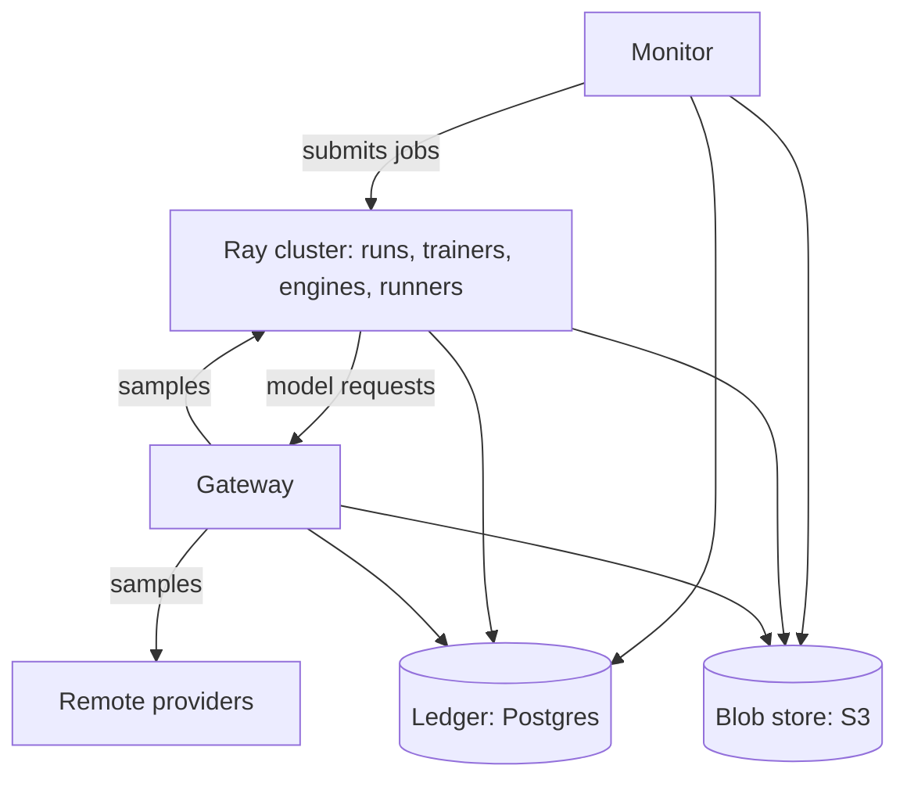

# What runs where

The platform is a handful of roles that never share memory: they coordinate through the ledger, the blob store and
the gateway. This page lists each role, what it needs, and how the roles reach each other, for anyone planning a
deployment.

**Read first:** [Start here](../start/README.md). **Next:** [Choose a setup](setups.md).

## The roles

- **The stores.** The **ledger** holds every decision and result in append-only tables: Postgres on a cluster, SQLite on
  one machine ([the ledger](../libraries/rollout-train/checkpoints.md#the-ledger)). The **blob store** holds
  checkpoints' files, [episodes](../libraries/rollout-train/episodes.md)' trajectories, datasets and imported
  environments, by their SHA-256: S3 or an S3-compatible store on a cluster, a directory of files on one machine. Both
  are the platform's only lasting state besides the state volume.
- **The state volume.** Node-local files the roles that keep files mount at `~/.cache/rollout`: run directories,
  Minecraft's servers and worlds, the Hugging Face cache (`HF_HOME`) and scratch space.
- **The Ray cluster.** Runs every run's work. On Kubernetes it is a RayCluster that KubeRay keeps: a head that runs no
  tasks, a GPU worker group and a CPU worker group, each started from zero by the autoscaler when work waits for it
  and removed when idle. Bridges between checkpoint formats, merges and environment builds run on it as Ray tasks.
- **Runs.** Each training run, eval, supervised step or environment check is a Ray job: on Kubernetes a RayJob with a
  Ray cluster of its own, sized from what the run needs. Its driver runs the loop and its episode runners; its
  trainer, inference engines and bridges run beside it, reserved together as one placement group
  ([what a run needs](../libraries/rollout-train/launching.md#what-a-run-needs)).
- **The gateway.** A stateless HTTP service that every model request goes through. It renders messages to tokens,
  samples a [channel](../libraries/rollout-train/channels.md), and records each turn in the ledger and the blob store
  ([the gateway](../libraries/rollout-train/gateway.md)). It holds no session, so it scales to any number of replicas.
- **The monitor.** A web page over a ledger and every run in it, which also imports environments from git and asks
  for runs ([the monitor](../libraries/rollout-train/monitor.md)). It reads the ledger and the blob store, and reaches
  the Ray cluster's job server.
- **Shared inference pools** (designed, not built yet). A long-lived Ray cluster of inference engines that serves
  every run bound to it, each run's checkpoints loaded side by side as adapters
  ([runtime design](../research/runtime-design.md#decisions-after-review)).
- **Remote providers.** Training and sampling outside the cluster: Tinker at Thinking Machines, GPU pods on RunPod,
  and hosted model APIs ([remote providers](providers.md)).

How they reach each other:

- runs, the gateway and the monitor each read and write the ledger and the blob store directly;
- episode runners send every model request to the gateway, and the gateway samples the inference engines or a
  remote provider;
- the monitor submits jobs to the Ray cluster's job server;
- inference engines load the checkpoints a run says its channel should serve from the blob store.

## What each role needs

The figures are the requests and limits in the chart's `values.yaml`, sized for a single node with one 16 GB GPU.
Raise them for bigger models or more episodes at once.

| Role | CPU (request) | Memory (request / limit) | GPU | Storage |
|---|---|---|---|---|
| Postgres (the ledger) | 0.25 | 512 MiB / 2 GiB | none | 20 GiB volume |
| S3-compatible store (blobs) | 0.25 | 256 MiB / 2 GiB | none | 200 GiB volume |
| Ray head | 0.5 | 2 GiB / 3 GiB | none | none |
| Ray autoscaler | 0.1 | 256 MiB / 1 GiB | none | none |
| Ray GPU worker (one per run that asks for a GPU) | 4 | 8 GiB / 14 GiB | 1 | none |
| Ray CPU worker (runs that use no local GPU) | 1, advertising 4 to Ray | 2 GiB / 4 GiB | none | none |
| A run's Ray cluster (one head pod, sized from the run) | the run's demand and 0.25 more (3.75 for the acceptance run) | its demand and 2 GiB (5 GiB for the acceptance run) / 14 GiB | the whole cards its engine hosts and trainer take | the state volume |
| The pod that submits a run's job | 0.1 | 256 MiB / 512 MiB | none | none |
| The Minecraft worlds' pool (`sandboxes-minecraft`, four worlds) | 4 | 7.5 GiB / 10 GiB | none | the state volume |
| Gateway, per replica | 0.25 | 512 MiB / 2 GiB | none | none |
| Monitor | 0.25 | 512 MiB / 3 GiB | none | none |
| State volume, shared by the pods that mount it | | | | 200 GiB |
| In-cluster registry and BuildKit (K3s only) | 1 for BuildKit | 1 GiB / 8 GiB for BuildKit | none | 100 GiB and 150 GiB |

What drives the numbers:

- **The GPU.** One 16 GB card trains a LoRA (low-rank adaptation) adapter on a 4-bit 9-billion-parameter model while
  vLLM serves it: the engines sleep while the trainer steps ([the LoRA trainer's
  measurements](../implementations/rollout-lora.md#measurements),
  [vLLM's](../implementations/rollout-vllm.md#measurements)). A run trained and sampled on Tinker needs no GPU.
- **Episodes.** Each Minecraft episode's world runs a Paper server and its bots' Node process: about 1 to 2 CPUs, and
  1.1 to 1.75 GiB ([measured](../research/minecraft-memory.md)), in the worlds' pool, not in the run's pods
  ([Where sandboxes run](../research/sandbox-placement.md)). A run's own parts wait on the model and the ledger: its
  driver uses a tenth of a CPU, however many episodes it plays
  ([what a run needs](../libraries/rollout-train/launching.md#what-a-run-needs)). The cluster config's `[guards]`
  (`runs_gib`, `training_gib`) say how much system memory must be free before a runner claims another episode, and
  before a step of a trainer that shares the engines' GPU.
- **Storage.** The blob store grows with every checkpoint's weights and optimizer state, and with every episode's
  trajectory; checkpoints' saves thin out with age
  ([checkpoints](../libraries/rollout-train/checkpoints.md#checkpoints)). The Hugging Face cache on the state volume
  holds every base model a run has loaded.
- **Postgres connections.** Each episode runner holds a pool of connections, so the chart starts Postgres with
  `max_connections=400`.
