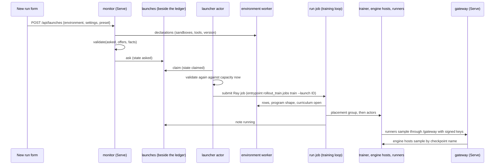
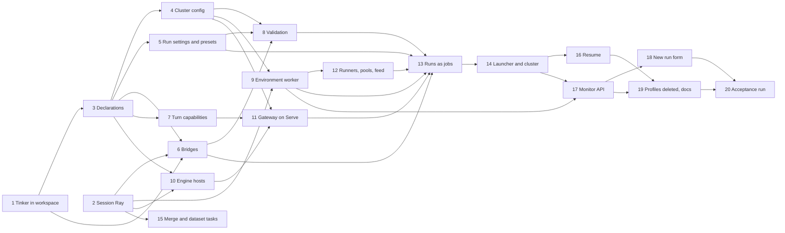

# Runtime design: one cluster config, run settings, providers, roles on Ray, one gateway

A design, to be carried out in the sequence of commits at its end. It removes profiles and every path that runs
without Ray, and describes what replaces them: one config per cluster, a run's own settings (with presets), inference
providers and trainers with declared capabilities and bridges between their formats, an environment worker that is
the only thing that imports an environment, every role as a Ray job, actor or task, and one gateway that samples every
channel. The architecture stays what it is: roles and what they exchange through the ledger, the blob store and the
gateway. Where each role runs is placement, said in the cluster config.

Read against main `0f90a2b`. Names in `code` that do not exist yet are what this design adds.

## Decisions at a glance

| Question | Decision |
|---|---|
| Where infrastructure is described | One TOML file per cluster (`cluster.toml`): the ledger, the blob store, the gateway, inference providers, trainers, sandbox pools, environments' Python environments, guards. Found by `--cluster`, `ROLLOUT_CLUSTER`, or `~/.config/rollout/cluster.toml`. Secrets are named (an environment variable, a file), never written |
| Where a run's recipe is | The run's settings, chosen in the New run form or on the command line, validated in one function, copied whole into the run's start. Presets are named, versioned settings kept beside the ledger and edited in the monitor; a run records the copy and the preset version it came from |
| What a run picks | An environment, a trainer, an inference provider for its trained channel, inference providers for its other channels, and the settings each takes |
| How formats meet | Trainers declare a checkpoint format (`peft`, `full`, `tinker`); inference providers declare the formats they load. A bridge (today's resharding layouts, generalised) turns one into the other as a Ray task on a CPU worker, chosen from the pair; a pair with no bridge is refused |
| What capabilities are checked | Inference providers declare token-exactness, sampled, prompt and top-k logprobs, whether they honour sampling parameters, adapters by name, full-weight reload, context, streaming and cost. Trainers declare what they produce, their models, longest segment, objectives and whether they score. The trained channel needs a token-exact provider with sampled logprobs; turns record what they were sampled with |
| How code reaches an environment | Only through an environment worker: one Ray actor per environment build, in that environment's own Python environment (a cached uv virtualenv, which Ray starts the actor in), answering a small protocol. The training loop, evals, `env check`, validation and the monitor ask it; runners that play its programs run in the same Python environment. The gateway, engine hosts, trainers and bridges stay in the platform's |
| What runs on Ray | Everything. A run is a Ray job; engine hosts, trainers, runners, environment workers, sandbox pools and the launcher are actors; the gateway and the monitor are Ray Serve applications; bridges, merges, dataset builds and venv builds are tasks. A single machine is a local Ray head (`rollout cluster up`); Kubernetes is KubeRay |
| What replaces `Platform.open()` | `RunActors`: a run job's assembly of its placement group, trainer actor, engine hosts and runners, closed when the job ends. The loop no longer publishes to engines: it writes what each channel serves, and whatever serves follows |
| The gateway | One Ray Serve application for the cluster. It builds each run's channels from the run's start (provider, model, renderer, limits) and samples them through one interface: engine host actors, vLLM servers elsewhere, Tinker's sampler (all asked for a checkpoint by name), or a frontier API |
| Launchers | One detached launcher actor per cluster. It offers capacity, inference providers and trainers with their capabilities and the pairs that bridge, environments and sandbox pools; it validates and submits Ray jobs, and nothing else |
| The acceptance test | A GSM8K run trained on Tinker (LoRA, Qwen/Qwen3.5-4B) and served on the local vLLM pool through the Tinker → PEFT bridge, launched from the New run form, with the `math` suite on a schedule, spend capped near $2 |

## What profiles hold today, and where each part goes

`rollout_train.profile.Profile` mixes three concerns, and `Platform.start` starts all of them in one process: the run's
registration, a Ray connection for reshards, orphaned engines ended, the trainer, every channel's engines, routes to
servers elsewhere, the feed, a gateway in process (or endpoints of one elsewhere), tool sets, sandbox pools with
keepers, the runner (`LocalRunner` or `DurableRunner`), the episode runner, a follower for `rollout runner`, and
`Colocated` around the trainer.

| Profile key | Goes to |
|---|---|
| `ledger`, `blobs` | cluster config `[ledger]`, `[blobs]` |
| `directory` | gone: a run is named by its id; node-local files go under the cluster's `[scratch]` |
| `channels.NAME.engine`, `engines`, `via`, `connection` | cluster config `[inference.NAME]` |
| `channels.NAME.model`, `renderer`, `thinking_tokens`, `answer_tokens` | run settings `channels.NAME.*` |
| `channels.NAME.reshard` | chosen automatically: a bridge, from the trainer's format and the provider's (`channels.NAME.bridge` records it) |
| `channels.NAME.max_lag` | run settings `max_lag` (changeable, as now) |
| `trainer.kind` | cluster config `[trainers.NAME]`; the run picks one with `trainer.provider` |
| `trainer.colocated` | cluster config `[trainers.NAME] colocate_with` |
| `trainer.*` (rank, rates, segments) | run settings `trainer.*` |
| `trainer.start`, `trainer.bookmark` | run settings `start`, `bookmark` |
| `evals` | run settings `evals.*` |
| `episodes_at_once` | run settings `episodes_at_once` |
| `runner` | cluster config `[runners] durable` |
| `serve`, `address`, `gateway.*` | cluster config `[gateway]` |
| `tools` | the environment declares its tool sets; shared services by URL in cluster config `[tools.NAME]` |
| `pools` | the environment declares its sandboxes; pools are cluster config `[sandboxes.KIND]` |
| `memory.runs_gib`, `memory.training_gib` | cluster config `[guards]` |
| `feed_runs` | cluster config `[monitor] feed_episodes` |
| `ray` | gone: Ray is always there |
| `name` | the launch (`--name`, the form's Name) |

## 1. The cluster config

### Shape, place, discovery

A TOML file, written once per cluster. It is the only description of infrastructure; nothing about a run is in it.

A process finds it in this order:

1. `--cluster PATH` or `--cluster NAME` on any `rollout` command (`NAME` is `~/.config/rollout/clusters/NAME.toml`);
2. the `ROLLOUT_CLUSTER` environment variable, a path or a name;
3. `~/.config/rollout/cluster.toml`.

Inside the cluster nothing reads the file again. `rollout cluster up` reads it, checks it, and hands it on:

- to the launcher actor and the Serve applications, as data (`Cluster`, a frozen dataclass);
- through them to every job and actor, as an argument (actors) or as `ROLLOUT_CLUSTER_JSON` in the job's runtime
  environment (jobs).

The parsed form holds no secret, only references to secrets, so it is safe to show in Ray's dashboard and the monitor.
On KubeRay the file is a ConfigMap mounted at `/etc/rollout/cluster.toml`, with `ROLLOUT_CLUSTER` pointing at it on the
head pod.

Every command that took `--ledger` (`rename`, `bookmark`, `pause`, `resume`, `checkpoints`, `suite`, `dataset`,
`merge`) takes the ledger from the cluster config instead.

### Every field

```toml
# ~/.config/rollout/cluster.toml: one machine, one 16 GB GPU
name = "home"                                 # what runs record as where they ran; the Ray namespace is rollout-home

[ray]
address = "auto"                              # the head this machine runs (rollout cluster up starts it)
jobs = "http://127.0.0.1:8265"                # the job server
temp_dir = "~/.cache/ray"                     # on disk: /tmp may be memory
memory_threshold = 0.85                       # Ray's memory monitor kills a task past this share of the machine's memory
python = "platform"                           # the interpreter platform actors run in: this checkout's .venv

[ledger]
url = "sqlite:///~/.cache/rollout/ledger.db"  # or url_env = "ROLLOUT_LEDGER_URL" (postgresql://user:password@…)

[blobs]
kind = "files"                                # or "rollout_s3:S3BlobStore" with its settings; credentials from its environment
directory = "~/.cache/rollout/blobs"

[scratch]
directory = "~/.cache/rollout/scratch"        # node-local: checkpoints in use, fetched bases, bridge work, built Pythons

[gateway]
url = "http://127.0.0.1:8830/gateway"         # how runners and harnesses reach it (Serve's proxy on every node)
port = 8830                                   # Serve's HTTP port
replicas = 1                                  # or autoscale = { min = 1, max = 8 }
keys_file = "~/.config/rollout/gateway.keys"  # or keys_env = "ROLLOUT_GATEWAY_KEYS"
lifetime = 21600                              # seconds a key minted for a slot is good for

[monitor]
route = "/"                                   # served by Serve on [gateway] port
feed_episodes = 80

[launcher]
at_once = 1                                   # runs it plays at once, beside what Ray's resources allow

[runners]
places = 8                                    # episodes one runner actor plays at once
durable = false                               # true: DurableRunner, its database at database_url(_env)

[guards]
runs_gib = 6                                  # system memory a node must have free before a runner claims an episode
training_gib = 4                              # and before a colocated step starts

# Inference providers: what samples a channel.
[inference.local-vllm]
kind = "vllm"                                 # engine hosts: Ray actors running rollout_vllm:VllmEngine
gpus = 1                                      # per replica
replicas = 1                                  # per run channel, unless the run asks for more (channels.NAME.replicas)
max_logprobs = 20                             # top-k logprobs it can return
[inference.local-vllm.models."Qwen/Qwen3.5-4B"]
context = 8192
options = { gpu_memory_utilization = 0.78, max_num_seqs = 20, max_lora_rank = 96 }
[inference.local-vllm.models."cyankiwi/Qwen3.5-9B-AWQ-4bit"]
base = "Qwen/Qwen3.5-9B"                      # quantized from: an adapter trained over the base can be served on it
context = 8192
options = { gpu_memory_utilization = 0.78, max_num_seqs = 20, max_lora_rank = 32 }

[inference.tinker]
kind = "tinker"
api_key_env = "TINKER_API_KEY"                # or api_key_file = "~/.tinker/credentials.json"
project_env = "TINKER_PROJECT_ID"
[inference.tinker.models."Qwen/Qwen3.5-4B"]
context = 65536
cost = { input = 0.0, output = 0.0 }          # dollars per million tokens, from Tinker's price list
[inference.tinker.models."Qwen/Qwen3.5-9B"]
context = 65536
cost = { input = 0.0, output = 0.0 }

[inference.openai]
kind = "api"
endpoint = "rollout_openai:ResponsesEndpoint"
api_key_env = "OPENAI_API_KEY"
[inference.openai.models."gpt-5"]
context = 400000
cost = { input = 0.0, cached_input = 0.0, output = 0.0 }

[inference.lab]                               # vLLM servers this cluster does not start
kind = "vllm-servers"
addresses = ["http://gpu-1:8000", "http://gpu-2:8000"]
via = "https://router.lab.example"            # optional: every request goes here
connection = { token_env = "ROLLOUT_ENGINES_TOKEN", ca = "~/.config/rollout/ca.pem" }
loader = { resources = { "lab-gpu" = 0.01 } } # where its follower actor runs: on the servers' machines, to hand them files
[inference.lab.models."Qwen/Qwen3-0.6B"]
context = 8192
options = { max_lora_rank = 32 }

# Trainers: what makes checkpoints.
[trainers.local-lora]
kind = "rollout_lora:LoraTrainer"
gpus = 1
colocate_with = "local-vllm"                  # shares that provider's GPU: its engines sleep while it steps
models = ["cyankiwi/Qwen3.5-9B-AWQ-4bit", "Qwen/Qwen3.5-4B", "Qwen/Qwen3-0.6B"]
segment_tokens = 8000                         # the longest segment this hardware trains on

[trainers.local-full]
kind = "rollout_lora:FullTrainer"
gpus = 1
colocate_with = "local-vllm"
models = ["Qwen/Qwen3-0.6B"]
segment_tokens = 4096

[trainers.tinker-lora]
kind = "rollout_tinker:TinkerTrainer"
gpus = 0
api_key_env = "TINKER_API_KEY"
project_env = "TINKER_PROJECT_ID"
models = ["Qwen/Qwen3.5-4B", "Qwen/Qwen3.5-9B"]
segment_tokens = 32768
cost = { train = 0.0 }                        # dollars per million tokens trained

# Sandbox pools, by the kind of sandbox an environment declares.
[sandboxes.minecraft]
provider = "minecraft_team.worlds:worlds"
python = "platform"                           # or the name of an environment whose Python the provider is in
size = 6
cpus = 2                                      # per sandbox
memory_gib = 1.5                              # per sandbox

# Tool sets served elsewhere, by name (an environment's own tool sets run with its programs).
[tools.search]
url = "https://search.lab.example"
connection = { token_env = "SEARCH_TOKEN" }

# Environments this cluster offers, and the Python environment each runs in.
[environments."minecraft_team.environment:environment"]
python = "platform"
[environments."rollout_verifiers.environments:gsm8k"]
project = "implementations/rollout-verifiers" # a uv project in the checkout: its lock is built into a cached virtualenv

# Optional: where each role runs, beyond the resources it asks for.
[placement.runners]
resources = { "cpu-node" = 0.01 }
[bridges."rollout_lora.bridges:merge_quantize"]
cpus = 8
memory_gib = 48
```

| Section | Fields | Notes |
|---|---|---|
| top | `name` | Required. Ray namespace `rollout-NAME`; launches may name a cluster |
| `[ray]` | `address`, `jobs`, `temp_dir`, `memory_threshold`, `python` | `rollout cluster up` starts a local head from these when `address = "auto"` finds none |
| `[ledger]` | `url` or `url_env` | `sqlite:///…` on one machine, `postgresql://…` for several |
| `[blobs]` | `kind` (`files` or `module:name`) and the store's settings | A setting whose name looks like a credential is refused (`stores.SECRET`) |
| `[scratch]` | `directory` | Node-local |
| `[gateway]` | `url`, `port`, `replicas` or `autoscale`, `keys_file` or `keys_env`, `lifetime` | |
| `[monitor]` | `route`, `feed_episodes` | |
| `[launcher]` | `at_once` | |
| `[runners]` | `places`, `durable`, `database_url` or `database_url_env` | |
| `[guards]` | `runs_gib`, `training_gib` | Checked on the node of the runner or trainer |
| `[inference.NAME]` | `kind` (`vllm`, `vllm-servers`, `tinker`, `api`), kind's fields, `models.MODEL.{context, base, cost, options}` | §2 |
| `[trainers.NAME]` | `kind` (`module:name`), `gpus`, `colocate_with`, `models`, `segment_tokens`, `cost`, secret references | §2 |
| `[sandboxes.KIND]` | `provider`, `python`, `size`, `cpus`, `memory_gib`, provider settings | One pool actor per kind (more with `pools = N`) |
| `[tools.NAME]` | `url`, `connection` | |
| `[environments."NAME"]` | `python = "platform"` or `project = PATH` | §4.6. Replaced by the environments table once environment publishing lands |
| `[placement.ROLE]` | `resources` | Roles: `gateway`, `monitor`, `launcher`, `runners`, `pools`, `engines`, `trainers`, `workers`, `bridges` |
| `[bridges."module:name"]` | `cpus`, `memory_gib` | Overrides a bridge's declared needs |

`rollout_train.cluster.load(path) -> Cluster` checks it: unknown keys are errors (as profiles were), every `kind` is
known, every trainer's `colocate_with` names a `vllm` provider, every environment's `project` has a `uv.lock`.
`rollout cluster check` loads it and reports, on this node, which secret references resolve (by name, never by value).

### Secrets

A secret appears only as a reference: `*_env` (an environment variable's name) or `*_file` (a file's path). It is
resolved where it is used, on that node, at the moment it is needed:

| Secret | Reference |
|---|---|
| The ledger's password | `[ledger] url_env` |
| The blob store's credentials | the store's own (`AWS_*` for S3), from the node's environment |
| The gateway's signing secrets | `[gateway] keys_file` or `keys_env` (`ROLLOUT_GATEWAY_KEYS`, as now) |
| Tinker's key | `api_key_env` or `api_key_file` |
| A frontier API's key | `api_key_env` |
| A vLLM server's or router's token | `connection.token_env` or `token_file` |

On a single machine, the shell that runs `rollout cluster up` (and so `ray start`) holds the environment. On KubeRay,
Kubernetes Secrets are set as environment variables (or mounted files) on the worker groups that need them: the
gateway's and the trainers'. No secret goes into the ledger, a heartbeat, a job's metadata, a run's start or the
parsed `Cluster`.

### Several clusters

Each cluster has its own file and its own `name`. Clusters may share a ledger and a blob store; they then share
checkpoints, suites, presets and launches, and each cluster's launcher claims only launches it can validate (a launch
may name a cluster with `cluster = "NAME"`). Each cluster keeps its own gateway, because its engine hosts are its own
actors. The CLI picks a cluster with `--cluster NAME`.

## 2. Providers: inference providers and trainers

### Inference providers and their capabilities

An inference provider is what samples a channel. Its kind's code declares what the kind can do
(`rollout_train.providers.Capabilities`), and the cluster config adds what this deployment has (models, context, rank,
cost). The gateway and validation read the merged result.

```python
@dataclass(frozen=True)
class Capabilities:
    token_exact: bool          # takes token ids and returns the exact sampled ids
    sampled_logprobs: bool     # each sampled token's logprob, under the distribution it was sampled from
    prompt_logprobs: bool      # logprobs of given tokens (forward-only scoring)
    top_logprobs: int          # k of the top-k logprobs it can return per position (0: none)
    honours_sampling: bool     # temperature and top-p are applied, so recorded logprobs describe what was sampled
    adapters: bool             # serves LoRA adapters by name
    full_reload: bool          # serves new full weights under a checkpoint's name
    streaming: bool            # replies as a stream (the gateway reads it whole before recording)
    loads: frozenset[str]      # checkpoint formats it serves: {"peft", "full"}, {"tinker"}, or none (base models only)

@dataclass(frozen=True)
class ModelOffer:
    model: str
    context: int
    base: str | None           # the model it was quantized from, if any
    max_lora_rank: int | None
    cost: Mapping[str, float]  # dollars per million tokens, by token class: input, cached_input, output, thinking
```

| Capability | `vllm` (engine hosts) | `vllm-servers` | `tinker` | `api` (OpenAI Responses) |
|---|---|---|---|---|
| token-exact | yes | yes | yes | no: text in, text out |
| sampled-token logprobs | yes (`processed_logprobs`) | yes (when started with `--logprobs-mode processed_logprobs`) | yes | no |
| prompt logprobs | yes | yes | as the SDK declares (checked by a live test) | no |
| top-k logprobs | yes, up to `max_logprobs` | yes, up to the servers' | as the SDK declares | no |
| honours sampling | yes | yes | yes | no (reasoning models fix temperature) |
| adapters by name | yes | yes (`VLLM_ALLOW_RUNTIME_LORA_UPDATING`) | its own checkpoints only | no |
| full-weight reload | yes, under the checkpoint's name | no (vLLM names full weights by the model it started with) | no | no |
| context | per model | per model | per model | per model |
| streaming | not used (in process) | yes | no | yes |
| cost per token class | none | none | per model | per model |
| loads | `peft`, `full` | `peft` | `tinker` | nothing |

An Anthropic Messages provider is another `api` implementation of `ModelEndpoint`, with the same capabilities as the
OpenAI one.

### Trainers and what they declare

A trainer's code declares, beside today's `weights` and `budget`:

```python
@dataclass(frozen=True)
class TrainerCapabilities:
    produces: str                    # "lora" or "full"
    format: str                      # the checkpoint format its files are in: "peft", "full", "tinker"
    objectives: frozenset[str]       # "policy_gradient/token", "policy_gradient/segment", "likelihood"
    scores: bool                     # can compute logprobs of given tokens (forward only)
    starts_from: frozenset[str]      # checkpoint formats a run may start from (besides the base model)
```

| | `rollout_lora:LoraTrainer` | `rollout_lora:FullTrainer` | `rollout_tinker:TinkerTrainer` |
|---|---|---|---|
| produces | `lora` | `full` | `lora` |
| format | `peft` | `full` | `tinker` (pointers to Tinker's sampler checkpoint and state) |
| objectives | both ratios, likelihood | both ratios, likelihood | both ratios, likelihood |
| scores | yes | yes | yes |
| starts from | `peft`, `full` (an adapter over full weights) | `full` | `tinker` |

The cluster config adds the deployment's facts: the models it trains here, the longest segment this hardware takes
(`segment_tokens`), its GPUs, colocation, cost.

### Checkpoint formats and bridges

A checkpoint's format is read from its files, not recorded (`rollout_train.bridges.format_of(manifest)`):
`weights/tinker.json` is `tinker`; `adapter_config.json` and `adapter_model.safetensors` are `peft`; `config.json` with
safetensors weights is `full`. A checkpoint can be in two formats at once (a Tinker checkpoint made with today's
`weights = "peft"` holds both).

A bridge turns a checkpoint's files from one format into a format a provider loads. Bridges generalise today's
resharding layouts: a bridge is a function named `module:name`, `bridge(weights, into, context) -> said`, run as a Ray
task on a CPU worker, noted in the ledger as now (`checkpoints/resharding`, `checkpoints/resharded`), its output kept
as blobs. The tables are keyed `CHECKPOINT@BRIDGE`, so one checkpoint can be bridged for several providers (trained on
Tinker, served on Tinker, evaluated on local vLLM). The desired-state serving record names the bridged files
(`Serving.files`, `Serving.layout`), exactly as a reshard's are named now.

Bridges are registered by the pair of formats (`rollout_train.bridges.BRIDGES`), and chosen automatically by a path
search over that graph (the cheapest path; most pairs are one edge):

| From | To | Bridge | Work |
|---|---|---|---|
| `tinker` | `tinker` | none: the serving record names the checkpoint's own files, and the Tinker sampler reads the pointer | — |
| `tinker` | `peft` | `rollout_tinker.bridges:peft`: download the sampler checkpoint's archive, remap Tinker's tensor names to PEFT's, join Qwen3.5's `in_proj_q`, `in_proj_k`, `in_proj_v` into `in_proj_qkv` (`fused`), write `adapter_config.json` | 2 CPUs, network; replaces `TinkerTrainer`'s inline `weights = "peft"` |
| `peft` | `peft` | `rollout_train.bridges:verbatim` (today's `resharding:verbatim`) | 1 CPU; hard links |
| `full` | `full` | `verbatim`; the engine host loads it under the checkpoint's name, replica by replica (below) | 1 CPU |
| `peft` over model B | `peft` on a provider model whose `base` is B (a 4-bit engine) | `verbatim`, "as is": the adapter applies to the quantized weights; the trainer's `kl_floor` and `mean_mismatch` measure the difference | 1 CPU |
| `peft` over model B | `full` on a provider model whose `base` is B | `rollout_lora.bridges:merge_quantize`: merge into B, quantize as the provider's model is; chosen only when the run says `channels.NAME.bridge = "merge-quantize"` | 8 CPUs, 48 GiB (configurable) |
| `peft`, `full` | `tinker` | refused: Tinker samples only checkpoints Tinker trained; there is no upload | — |

A full checkpoint on an engine host is loaded under the checkpoint's name, replica by replica: with two replicas or
more, one loads while the others serve the checkpoint before, and the gateway sends each turn to a replica that holds a
checkpoint within `max_lag` (a turn samples one checkpoint from its beginning to its end). With one replica, the load
drains it: a turn caught by the load is sampled again from the start (`Unserved`), as now.

A bridge declares how it changes an adapter's rank (`rank_factor`): `rollout_tinker.bridges:peft` declares 3 for a
model with Qwen3.5's linear-attention layers when each of q, k and v has an A of its own, so validation checks
`trainer.rank × 3 <= max_lora_rank` before a run starts, not when an engine refuses the load.

### Rules: who may use which provider

| Role of the provider | Required capabilities | Why |
|---|---|---|
| The trained channel | token-exact, sampled-token logprobs, honours sampling, and `loads` reached by a bridge from the trainer's format | The importance weight needs the behaviour logprob of each exact sampled token. Local vLLM and Tinker qualify; OpenAI and Anthropic do not: "the OpenAI Responses API returns text, not the sampled token ids and their logprobs, which the importance weight needs" |
| Another channel (a fixed opponent, a judge) | any | Its turns are recorded and never trained on |
| An eval's subject | any; a checkpoint needs a bridge to the provider's `loads` | |
| An SFT data source (a dataset's turns) | any | Without sampled logprobs the data is supervised: the trainer computes logprobs itself and nothing is importance-corrected. The dataset records `supervision: "supervised"` (else `"importance"`), and the imitation step records it |
| A distillation teacher | prompt logprobs (to score the student's tokens), or top-k logprobs with k at least the run's `distill.k` for distribution matching; the same renderer family as the student | Validated when distillation runs exist; the rule is in `rollout_train.validation` from the start |
| A trainer that scores (distillation on the student's side, recomputed logprobs for supervised data) | the trainer's `scores` | |

### What a turn records

The gateway records whatever the provider gives, and says what that was. `TurnRecord` gains `sampled_with`, the
capabilities the turn was sampled with:

```json
"sampled_with": ["token_exact", "sampled_logprobs", "honours_sampling"]
```

An `api` turn records `[]`: its completion is the reply rendered with the channel's renderer (when the channel names
one), its mask all True, its logprobs NaN. A turn record that does not say is one recorded before this field existed;
every such turn came from vLLM or Tinker, and is token-exact with sampled logprobs.

Segments carry the intersection of their turns' `sampled_with`. The algorithm refuses to train on a segment without
`token_exact` and `sampled_logprobs`, and the group's result says why ("turns of channel `policy` were sampled without
behaviour logprobs, by provider `openai`"), instead of a NaN reaching the trainer. Validation makes this unreachable
for a trained channel; the check is the backstop.

## 3. A run's settings

### The schema

A run's settings are a flat mapping of dotted keys, as now (`settings.fixed`, `settings.changeable` in the run's
start). `rollout_train.settings.RunSettings` is the schema: each key's type, default, whether it is fixed or
changeable, and which kinds of run take it. Keys whose meaning did not change keep their names, so a start written by a
profile-era run compares key by key (§7).

**Fixed** (decided when the run starts):

| Key | Type, default | Says |
|---|---|---|
| `environment` | `module:name` (later `NAME@VERSION`) | The environment; its build and version are recorded beside it |
| `groups` | int, 100 | Groups it plays |
| `seed` | int, 0 | |
| `start` | checkpoint reference, none | What it trains from (resolved id recorded); none: the base model |
| `bookmark` | string, none | A bookmark it carries to each checkpoint |
| `episodes_at_once` | int, 6 | Episodes it keeps work waiting for |
| `trainer.provider` | a `[trainers.NAME]` | The trainer |
| `trainer.channel` | string, `policy` | The trained channel |
| `trainer.model` | model id, the trained channel's model | What the trainer trains over (Tinker trains `Qwen/Qwen3.5-9B` while a 4-bit engine serves `cyankiwi/Qwen3.5-9B-AWQ-4bit`) |
| `trainer.objective`, `trainer.ratio` | as the trainer takes them | Checked against its `objectives` |
| `trainer.KEY` | the trainer's own fixed settings | `rank`, `segment_tokens`, `segments_per_step`, … |
| `channels.NAME.provider` | a `[inference.NAME]` | What samples the channel |
| `channels.NAME.model` | model id | Among the provider's models |
| `channels.NAME.renderer` | `module:name` | Optional for an `api` channel |
| `channels.NAME.thinking_tokens`, `channels.NAME.answer_tokens` | int or none | The thinking budget, as now |
| `channels.NAME.replicas` | int, the provider's `replicas` | Engine hosts for a `vllm` channel |
| `channels.NAME.bridge` | `auto`, or `merge-quantize` | Written as the bridge chosen (`module:name`) in the start |

**Changeable** (taken from the next step on, as now: `rollout_train.settings.CHANGEABLE` and the trainer's own):

| Key | Type, default |
|---|---|
| `groups_per_step` | int, 4 |
| `max_lag` | int, 1 |
| `evals.suite` | suite name or `NAME@N`, none |
| `evals.every` | int, 1 |
| `evals.episodes` | int or none |
| `limits.spend` | dollars or none: the loop ends the run at the next step boundary once its estimated spend (the trainer's tokens times its cost, plus each paid provider's sampled tokens times theirs) reaches it |
| `trainer.KEY` | each setting the trainer's `Changeable` takes (`learning_rate`, the clips, `truncate`, `tokens_per_step`, `max_kl`, `max_gradient_norm`) |

Beside them, as now: `paused` in the run's desired settings.

A trainer's settings are declared by its settings dataclass (`LoraSettings`, `TinkerSettings`): name, type, default,
fixed or changeable. `rollout_train.providers.settings_of(trainer)` reads them without loading torch, so the launcher
offers them and the form shows them with their defaults.

### The command line

`rollout train` asks for a launch and follows it; it does not run the loop in the calling process.

```bash
rollout train rollout_verifiers.environments:gsm8k --name gsm8k-tinker-4b \
    --trainer tinker-lora --model Qwen/Qwen3.5-4B --provider local-vllm --renderer rollout_qwen:qwen35 \
    --set trainer.rank=16 --set trainer.learning_rate=1e-4 --set channels.policy.thinking_tokens=1024 \
    --set channels.policy.answer_tokens=512 --set evals.suite=math --set evals.every=1 --set limits.spend=2 \
    --groups 12 --groups-per-step 4

rollout train minecraft_team.environment:environment --preset minecraft-one-gpu --name team-8 \
    --set trainer.learning_rate=3e-5          # a preset, with one setting changed

rollout train ENVIRONMENT --settings run.toml # the settings as a TOML file of dotted keys: a script's input
rollout train ... --check                     # validate only: print the plan (bridge, placement) or the refusals
rollout train ... --detach                    # print the launch id and return
```

`--model`, `--provider`, `--renderer` and `--trainer` set `channels.policy.model`, `channels.policy.provider`,
`channels.policy.renderer` and `trainer.provider`; `--channel NAME` changes which channel they are about.
`--set KEY=VALUE` sets any key (a TOML value, as now). Precedence: the schema's defaults, then the preset, then the
file, then the flags.

Followed, it prints the launch's states and then the job's output (`ray job logs --follow`), until the run ends; an
interrupt asks the launch to stop, as the monitor's Stop does.

### Presets

A preset is a named, versioned set of run settings, kept beside the ledger as ordinary state (as launches and desired
settings are): `FilePresets` (`presets.json` beside a ledger of files) and `DatabasePresets` (a `presets` table).

```python
@dataclass(frozen=True)
class Preset:
    name: str
    version: int                       # 1, 2, …: each save is a new version; nothing is changed in place
    settings: Mapping[str, JsonValue]  # any run settings except name; environment and start are allowed
    saved: float
    note: str = ""
```

- A preset's name points to its newest version; `NAME@N` names one version.
- Saving appends a version (compare-and-set on the newest number, so two editors make two versions, never one lost).
- A run records a full copy of its settings (its start's `fixed` and `changeable`) and, as provenance only,
  `preset: "minecraft-one-gpu@3"`. Editing the preset later changes no run, and resuming a run uses its own copy.
- Commands: `rollout preset list`, `rollout preset show NAME[@N]`,
  `rollout preset save NAME (--from-run RUN | --settings FILE | --set …)`, `rollout preset delete NAME` (marks it
  deleted; versions stay readable for the runs that name them).
- The monitor has a Presets page: the list, a preset's versions with what each changed, and an editor that saves a new
  version. The New run form has "Save as preset".

### The New run form

| Form | Settings | Choices come from |
|---|---|---|
| Environment | `environment` | The launcher's offered environments (name, version, description from the environment worker) |
| Preset | fills the form; recorded as `preset` | Presets |
| Name | the launch's name | |
| Start, Bookmark | `start`, `bookmark` | Checkpoints and bookmarks; a checkpoint the chosen trainer cannot start from is disabled, with the reason ("a full-weight trainer starts from full weights: merge this adapter first") |
| Groups, Groups a step, Seed | `groups`, `groups_per_step`, `seed` | |
| Trainer | `trainer.provider`, `trainer.model` | Offered trainers, each with what it produces, its format, models and cost |
| Trained channel's inference | `channels.policy.provider`, `.model`, `.renderer`, `.replicas` | Offered providers; one that cannot serve the trained channel, or has no bridge from the trainer's format, is disabled with the reason. The chosen pair shows its bridge ("Tinker → PEFT, then loaded by name") |
| Other channels | `channels.NAME.*` | Any provider |
| Limits | `channels.NAME.thinking_tokens`, `answer_tokens`, `limits.spend` | |
| Trainer settings | `trainer.KEY` | The trainer's declared settings, with defaults; changeable ones marked |
| Evals | `evals.suite`, `evals.every`, `evals.episodes` | Suites whose environments are offered |
| Capabilities | shown, not set | Each provider's row of the capability table, and the estimated cost per step where a provider or trainer bills |

Submitting sends the settings to `POST /api/launches`; the monitor validates them with the same function the launcher
uses (§6) and shows refusals beside the fields they name. `POST /api/launches/check` validates without asking.

### `rollout eval`, `rollout imitate`, `rollout env check`

All three take the same settings, through the same flags, `--preset` and `--settings`; each kind takes the keys that
apply to it, and validation refuses the rest.

```bash
# A checkpoint: its model, renderer and provider are its run's, unless said otherwise.
rollout eval math --checkpoint gsm8k-tinker-4b:3
rollout eval math --checkpoint gsm8k-tinker-4b:3 --provider local-vllm   # bridged Tinker → PEFT first
# The base model: say the channel.
rollout eval math --model Qwen/Qwen3.5-4B --provider tinker --renderer rollout_qwen:qwen35 --episodes 4
rollout eval math --model gpt-5 --provider openai                         # any provider can be an eval subject

rollout imitate --name team-sft-2 --dataset solved-teams --start team-7:31 --trainer local-lora \
    --set trainer.learning_rate=1e-4 --set imitation.passes=3

rollout env check rollout_verifiers.environments:gsm8k              # the worker's checks and a scripted episode
rollout env check ENVIRONMENT --model Qwen/Qwen3.5-4B --provider local-vllm --renderer rollout_qwen:qwen35 \
    --groups 4                                                       # groups played: a launch of kind check
```

| Kind | Keys it takes |
|---|---|
| `train` | all of the above |
| `eval` | `channels.*` (the subject's channel), `episodes` (`--episodes`), the suite (positional), `start` (`--checkpoint`) |
| `imitate` | `trainer.*`, `start`, `seed`, `imitation.limit`, `imitation.passes`, `imitation.warmup`, `imitation.resume_optimizer`, `imitation.dataset`, `imitation.without` |
| `check` | `channels.*`, `groups`, `seed`, `check.episodes` |

`--checkpoint`'s defaults come from the start of the run that made it (`channels.policy.model`, `renderer`, `provider`).

## 4. Roles on Ray

### The roles

| Role | Ray form | Name (namespace `rollout-CLUSTER`) | Resources | Lifetime | Python |
|---|---|---|---|---|---|
| Launcher | detached actor | `launcher` | 0.1 CPU, on the head (`node:__internal_head__`) | cluster | platform |
| Gateway | Ray Serve application, `replicas` replicas | Serve app `gateway`, route `/gateway` | 1 CPU per replica | cluster | platform |
| Monitor | Ray Serve application, 1 replica | Serve app `monitor`, route `/` | 0.5 CPU, on the head | cluster | platform |
| Sandbox pool | detached actor per kind (or `pools = N`) | `pool/KIND/N` | `size × cpus` CPUs, `size × memory_gib` memory | cluster | `[sandboxes.KIND] python` |
| Environment worker | detached actor per environment build | `environment/BUILD` | 0.5 CPU | until idle 30 minutes with no run open in it | the environment's |
| Training loop (and eval, imitation, check) | Ray job: its entrypoint process | job `run-LAUNCH` | 1 CPU | the run | platform |
| Trainer | actor of the job | `run/RUN/trainer` | the trainer's `gpus` and 2 CPUs, in the run's placement group | the run | platform |
| Engine host | actor of the job, per replica of a `vllm` channel | `run/RUN/engine/CHANNEL/N` | the provider's `gpus`, in the run's placement group | the run | platform |
| Follower for `vllm-servers` | actor of the job | `run/RUN/loader/CHANNEL` | 0.1 CPU and the provider's `loader.resources` | the run | platform |
| Episode runner | actor of the job | `run/RUN/runner/N` | 1 CPU, `places` places | the run | the environment's |
| Feed | actor of the job | `run/RUN/feed` | 0.1 CPU | the run | platform |
| Bridge | task | | the bridge's `cpus`, `memory_gib` | one checkpoint | platform |
| Merge, dataset build | task, submitted by `rollout merge`, `rollout dataset make` | | CPU and memory as declared | one call | platform |
| Python build | task, on the node that needs it | | 1 CPU | one build | platform (it runs `uv`) |

Per-run actors are owned by the job's entrypoint process: Ray ends them when the job ends, so a stopped or failed run
leaves no engine or runner behind, which replaces `engine.json` and `end_orphans`. Cluster actors are detached.

On KubeRay the same roles land on worker groups by resources: a GPU group (engine hosts, local trainers), a CPU group
(runners, pools, gateway replicas, bridges, environment workers), and the head (launcher, monitor). `[placement.ROLE]`
adds custom resources to steer a role to a group.

### A run's placement group

The run job reserves one placement group for its GPU roles before it starts anything:

- a colocated trainer (`colocate_with` names the trained channel's provider): one bundle `{GPU: 1, CPU: 3}`, `STRICT_PACK`;
  the trainer actor and the engine host each ask for `num_gpus = 0.5` in it, so Ray gives both the same device;
- otherwise one bundle per engine host replica and one for a local trainer, `PACK`;
- a Tinker trainer with `tinker` inference: no GPU bundle at all.

A run whose placement group cannot be reserved waits in Ray's queue; one whose demand exceeds the cluster's total is
refused at validation (§6).

### Finding the ledger, the blob store and the gateway

Every job and actor is given the `Cluster` and opens the ledger (`[ledger]`), the blob store (`[blobs]`) and the
desired settings, launches, presence, presets and leases beside the ledger, resolving secrets on its node
(`rollout_train.cluster.Stores.open(cluster)`). Runners and harnesses reach the gateway at `[gateway] url`, over HTTP,
through Serve's proxy on their own node. Actors find each other by name in the cluster's namespace: the gateway
finds a run's engine hosts as `run/RUN/engine/CHANNEL/N`, runners find pools as `pool/KIND/N`, the monitor finds a
run's feed as `run/RUN/feed` and an environment's worker as `environment/BUILD`.

### Restarts

Every actor is started with `max_restarts=-1`. Fences make each takeover safe, as they do now:

| Role | On restart |
|---|---|
| Training loop | A job does not restart by itself. The launch is noted failed; `rollout resume` (or the monitor's Resume) asks for a launch of the same run, whose loop takes the run's fence anew and goes on from the ledger |
| Trainer | Holds nothing between steps: a step says its parent's files. The loop's call fails with the actor; the step is taken again (`StepFailed`) |
| Engine host | Starts its engines and reloads what the run's serving record says (`Follower`); the gateway routes around it meanwhile (`Unreachable`) |
| Gateway replica | Stateless. A runner's request is retried under its effect id; a recorded turn is answered from the record |
| Episode runner | Restarted under the same name, it takes its runner fence anew; its claims lapse and are played again, or, over the durable runner, are adopted |
| Environment worker | Answers again; a run's curriculum is rebuilt from the ledger when the loop next asks for it (§4.6) |
| Sandbox pool | Its leases are beside the ledger; its keeper takes the pool's fence anew and releases leases whose claims lapsed |
| Launcher | Follows its jobs again by the launches' `job` field (today's `_adopt`) |

### What replaces `Platform.open()`

`rollout_train.jobs` holds the entrypoints a launch's job runs: `train`, `evaluate`, `imitate`, `check`. Each reads its
launch, opens the stores, starts what the run needs with `RunActors`, and runs the loop it always ran:

```python
async def train(launch: Launch, cluster: Cluster) -> None:
    stores = Stores.open(cluster)
    settings = RunSettings.of(launch.asked.settings)
    environment = await EnvironmentClient.of(cluster, settings.environment)   # the worker, by build
    run = await stores.registered(launch)                                     # the run's id, named once
    async with RunActors.start(cluster, stores, run, settings, environment) as actors:
        async with ending(stores.ledger, run.id):
            await loop.train(
                environment, actors.trainer, stores.checkpoints, start=actors.origin, channel=settings.trained,
                base=settings.trainer_model, directory=actors.scratch / "checkpoints",
                groups=settings.groups, groups_per_step=settings.groups_per_step, max_lag=settings.max_lag,
                seed=settings.seed, episodes_at_once=settings.episodes_at_once, binding=actors.binding,
                run=run.id, started=actors.started, hooks=[actors.feed], kept=actors.bookmarked, made=actors.made,
                bridge=actors.bridge, evals=actors.schedule, desired=actors.desired, scheduled=actors.scheduled,
            )
```

`RunActors.start`, in order: reserve the placement group; start the trainer actor (`TrainerClient`, a `Trainer` over
the actor handle; wrapped in `Colocated` over `HostPausable` engine host handles when colocated); start the engine
hosts (or the `vllm-servers` follower) for each channel that needs them; start the feed actor; start
`ceil(episodes_at_once / places)` runner actors in the environment's Python, each an `EpisodeRunner` over a
`LocalRunner` or `DurableRunner`, recording through `GatewayEndpoints([gateway] url)`, with the environment's pools as
`ActorPool`s and its tool sets; record the run's start. On the way out, in reverse; the job's end ends whatever is left.

What changes in the loop and evals:

- `train` and `evaluate` lose `publish`. Every channel is served by whatever follows the run's serving record, so the
  loop writes the record (as it already does first) and nothing else.
- `reshard` becomes `bridge`: `(checkpoint, fence) -> Manifest`, always a Ray task (`bridges.on_ray`); the path that
  reshards in the calling process is removed.
- The runners' `runs` filter is a predicate, not a set the loop adds to: a runner plays a run when that run is this run,
  or its newest start's `by` or `part_of` leads to it (the walk `settings.paused` already makes).
- The feed is an actor the runners' hooks and the loop tell, and the monitor asks; `--monitor` and the run's `address`
  are removed.
- A run's identity is its id, assigned when the launch is asked. `run.json`, `ledger.json` and run directories are
  removed; node-local files go under `[scratch]/RUN`, and the job's output is Ray's job log, which the monitor shows.

### How a launch becomes a run



### Python environments: the environment worker

The training loop never imports an environment. One actor per environment build, the **environment worker**, is the
only process that does, and it runs in that environment's own Python environment. Everything that reads an
environment asks it:

| Caller | Today | Asks the worker for |
|---|---|---|
| Training loop | `named(environment)`, `curriculum_of`, `binding_for` | rows, train starts, eval data, curriculum, program shape |
| Evals | `environments_of(suite)` | eval data, program shape |
| `rollout env check` | `named(environment)`, `checked` | `check()`: the structural checks and a scripted episode, run in the worker |
| Launch validation | `named(...)` in `_checked_evals` | sandboxes, tool sets, version, description |
| Monitor | `named(...)` in `monitor/environments.py` | rows, eval data, description, version (so an environment that does not load in the platform's Python still has its page) |
| `rollout suite make` | `named(environment)`, `suite_entry` | eval data, `drawn` starts |

**The protocol** (`rollout_train.environments.EnvironmentWorker`; every value JSON, so it crosses any process
boundary):

| Call | Returns |
|---|---|
| `describe()` | `{name, version, build, description}` |
| `rows()` | `[{key, title}]` |
| `train_start(row, seed)` | the start's parameters, drawn with `Random(seed)`, never an eval start (`train_start`) |
| `evals()` | `{name: [start]}` |
| `drawn(seeds, rows)` | `[start]` |
| `program(start)` | the program reference, its slots, its imports, its sandboxes' specs (what `binding_for` learns by instantiating it) |
| `tool_sets()` | `{name: module:name}`: the tool sets its programs import, which runners start beside them |
| `sandboxes(start)` | `[SandboxSpec]` (`Environment.sandboxes(start)`) |
| `curriculum_open(run)` | the run's curriculum, built by replaying the run's results and evals from the ledger (the replay at the top of `loop.train` moves here); idempotent |
| `curriculum_sample(run, pending, seed)` | a row key |
| `curriculum_recorded(run, number, result)` | the number of unlocked rows; a group number seen before is ignored |
| `curriculum_evaluated(run, suite, checkpoint, results, entry)` | nothing |
| `curriculum_close(run)` | nothing |
| `check(row, reply)` | the checks' results and the scripted episode's |

Randomness stays the loop's: it draws a seed from its own generator for each call that draws, so a run's draws do not
depend on where the worker runs. A worker that restarted answers `curriculum_sample` for an unknown run with
`Unopened`, and the client opens the curriculum again first.

`EnvironmentClient` implements `rollout.environment.Environment` (and the curriculum calls) over a worker handle,
caching what does not change (rows, eval data, description), so `loop.train`, `evaluate` and `check` take it where they
take an `Environment` now.

**Which Python.** A build is a Python environment, built once per node and cached under
`[scratch]/pythons/BUILD`:

- `python = "platform"`: the platform's own interpreter (Minecraft, the toy games). Same actor, same protocol; there is
  no in-process path.
- `project = PATH`: `uv sync --frozen --project PATH` into the cache, keyed by `BUILD = sha256(uv.lock, pyproject.toml,
  every source file)`. Once environment publishing lands, the source comes from the environment's blobs and `BUILD`
  is its manifest hash, the version id; nothing else changes.

The worker actor, and the runner actors of a run on that environment, are started with
`runtime_env={"py_executable": "[scratch]/pythons/BUILD/bin/python"}` (with `RAY_ENABLE_UV_RUN_RUNTIME_ENV=0`, as
`ray_cluster.prepare()` sets). A Python build task (`rollout_train.environments.build`) runs first on the node Ray
chose, by node affinity, and is a no-op where the build is cached.

The environment's lock must hold `rollout-train` (with `ray` at the cluster's exact version, which `rollout-train`
then depends on) beside its own dependencies: the worker and the runners run platform code that plays its programs.
The worker checks `ray.__version__` against the cluster's when it starts, and refuses with the project to fix.
Resolved in a scratch copy of `implementations/rollout-verifiers`: `rollout-train[http,durable,ray]` resolves beside
`verifiers 0.3.2.dev185` with `openai 2.54.0` and `ray 2.59.0`, the workspace's Ray. The gateway, engine hosts,
trainers and bridges never import an environment, so they stay in the platform's Python, with vLLM, torch and the
`tinker` SDK.

**Why cached uv virtualenvs, started by Ray, rather than Ray's own `pip` or `uv` runtime environments:**

- **Exact locks.** `uv sync --frozen` installs the environment's lock as locked. Ray's `pip`/`uv` fields install a
  requirement list into a virtualenv layered over the base interpreter's site-packages, so the platform's openai 3
  would sit under verifiers' openai 2.
- **One key for cache and record.** The build hash is what the cache is keyed by, what the run's start records, and,
  with publishing, the version id.
- **One mechanism everywhere.** The same build task runs on a laptop's local head and on a KubeRay worker (the cache on
  the node's disk or a volume). It needs no size limit on Ray's packaged working directories, which Minecraft's assets
  would exceed.
- **Ray still places and supervises.** `py_executable` is a Ray runtime environment field: Ray starts the actor in the
  built interpreter, restarts it, and ends it with the job.

## 5. The unified gateway

### One application

The gateway is one Ray Serve application per cluster (`rollout_train.gateway.serve:Gateway`, a deployment over today's
`create_app`). Serve's proxy on every node passes requests to its replicas at `[gateway] port`, route `/gateway`.
`max_ongoing_requests` is 512 per replica and there is no request timeout, since a thinking turn may take minutes. A
replica opens the stores and the keyring from the `Cluster`, and keeps no session, as now. `rollout gateway PROFILE`
and `deployed(profile)` are removed.

### Channels per run, from the run's start

A grant names a run and a channel (`grant.run`, `grant.channel`). A replica resolves them with a `ChannelDirectory`:

1. Read the run's newest start (cached until the run's `ends` record): its settings say the channel's provider, model,
   renderer and budgets.
2. Read what the channel should serve (`serving.wanted`): the checkpoint, its files, `sequence`, `max_lag`, and
   `served_by` (an eval its training run's schedule asked for is sampled on the training run's channel).
3. Build the sampler for the provider's kind, once per run and channel.

Nothing registers a channel with the gateway: a run's channels exist once its start is written. An eval's channel is
built from the eval's start the same way.

### Samplers by provider kind

Every trainable channel is a `RemoteChannel` (today's choice of checkpoint by name within `max_lag`, routing by session
over servers that answer, `Unserved` on a mismatch). What changes is what a "server" is: `RemoteChannel` takes servers
by a protocol (`CheckpointServer`) that `RemoteEngine` already nearly is:

```python
class CheckpointServer(Protocol):
    address: str
    async def models(self, within: float = 2.0) -> dict[str, Any]: ...   # the checkpoints it holds, by name
    async def generate(self, prompt: Sequence[int], *, max_tokens: int, temperature: float, top_p: float,
                       stop_token_ids: Sequence[int], adapter: str | None, session: str = "",
                       request: str | None = None) -> Generation: ...     # Generation.model: who sampled it
```

| Provider kind | Servers | Who loads checkpoints |
|---|---|---|
| `vllm` | `HostServer`: a handle of each engine host actor (`run/OWNER/engine/CHANNEL/N`, where OWNER is the run or its `served_by` run); calls are actor calls | Each engine host's `Follower`, into its in-process `VllmEngine`: adapters by checkpoint id, full weights under the checkpoint's id |
| `vllm-servers` | `RemoteEngine` at each address, or one at `via` | The run's follower actor on the servers' machines (today's `rollout engines`) |
| `tinker` | `TinkerServer` (`rollout_tinker.server`): `models()` holds every checkpoint whose files have a Tinker pointer; `generate(adapter=CHECKPOINT)` reads the pointer from the blob store (once per checkpoint) and samples Tinker's sampler checkpoint; the base model by its name | Nobody: the trainer saved the sampler checkpoint when it made the step |
| `api` | none: an `EndpointSampler` over the `ModelEndpoint` (`rollout_openai:ResponsesEndpoint`), canonical request in, canonical reply out; recorded with `sampled_with = []` | — |

So the gateway asks every token-level backend the same question (sample this prompt from the checkpoint named), and
records what comes back with the checkpoint the answer names.

### A Tinker-trained run served locally, and evals

```mermaid
sequenceDiagram
    participant Loop as training loop
    participant Trainer as trainer actor (Tinker)
    participant Bridge as bridge task (CPU)
    participant Ledger as ledger and blobs
    participant Host as engine host (vLLM)
    participant Gateway as gateway
    Loop->>Trainer: step(batch, parent files)
    Trainer-->>Loop: weights/tinker.json (sampler checkpoint, state)
    Loop->>Ledger: checkpoint (format tinker)
    Loop->>Bridge: rollout_tinker.bridges:peft (checkpoint, fence)
    Bridge->>Ledger: resharding CKPT@peft, then resharded: PEFT files as blobs
    Loop->>Ledger: serving: policy serves CKPT, files = bridged PEFT
    Host->>Ledger: follows serving, fetches the files
    Host->>Host: load_adapter(CKPT)
    Gateway->>Host: generate(adapter = CKPT) for each turn
    Host-->>Gateway: tokens, logprobs, model = CKPT
```

Evals flow through the same records:

| Eval | What happens |
|---|---|
| A training run's scheduled eval | The eval's runs record serving with `served_by = RUN/policy`; the gateway samples the training run's channel, as now |
| A Tinker checkpoint on Tinker | The eval job records serving with the checkpoint's own files; no engine host; the gateway's `TinkerServer` samples its sampler checkpoint |
| A Tinker checkpoint on local vLLM | Validation finds the bridge `tinker → peft`; the eval job runs it (or finds `CKPT@rollout_tinker.bridges:peft` done), records serving with the bridged files, and starts its own engine hosts, which follow and load it |
| A local LoRA checkpoint on vLLM | `verbatim`, then as above |
| A local checkpoint on Tinker | Refused at validation: there is no upload |
| A frontier model (base only) | `api` provider; no serving to follow |

### Keys

Unchanged: the gateway's replicas and every runner hold the same secrets (`[gateway] keys_file` or `keys_env`); a key
names its run, slot, channel and fence, and is verified with nothing but the secret.

## 6. Launchers and validation

### What a launcher offers

One launcher per cluster: a detached actor that beats beside the ledger (`launcher/CLUSTER`) and offers:

```json
{
  "kind": "launcher", "cluster": "home", "playing": 1, "at_once": 1,
  "capacity": {"total": {"GPU": 1, "CPU": 16, "memory_gib": 23}, "free": {"GPU": 0, "CPU": 9, "memory_gib": 11}},
  "inference": [
    {"name": "local-vllm", "kind": "vllm", "gpus": 1,
     "capabilities": {"token_exact": true, "sampled_logprobs": true, "prompt_logprobs": true, "top_logprobs": 20,
                      "honours_sampling": true, "adapters": true, "full_reload": true, "streaming": false,
                      "loads": ["peft", "full"]},
     "models": [{"model": "Qwen/Qwen3.5-4B", "context": 8192, "max_lora_rank": 96}]},
    {"name": "openai", "kind": "api", "capabilities": {"token_exact": false, "sampled_logprobs": false, "...": "..."},
     "models": [{"model": "gpt-5", "context": 400000, "cost": {"input": 0.0, "output": 0.0}}]}
  ],
  "trainers": [
    {"name": "tinker-lora", "kind": "rollout_tinker:TinkerTrainer", "gpus": 0,
     "capabilities": {"produces": "lora", "format": "tinker", "scores": true,
                      "objectives": ["policy_gradient/token", "policy_gradient/segment", "likelihood"]},
     "models": ["Qwen/Qwen3.5-4B", "Qwen/Qwen3.5-9B"], "segment_tokens": 32768,
     "settings": [{"key": "trainer.rank", "type": "int", "default": 32, "changeable": false},
                  {"key": "trainer.learning_rate", "type": "float", "default": 1e-4, "changeable": true}]}
  ],
  "pairs": [
    {"trainer": "tinker-lora", "inference": "local-vllm", "bridge": "rollout_tinker.bridges:peft", "rank_factor": 3},
    {"trainer": "tinker-lora", "inference": "tinker", "bridge": null},
    {"trainer": "local-lora", "inference": "tinker", "refused": "Tinker samples only checkpoints Tinker trained: there is no upload"},
    {"trainer": "local-lora", "inference": "openai", "refused": "the OpenAI Responses API returns text, not the sampled token ids and their logprobs, which the importance weight needs"}
  ],
  "environments": [
    {"name": "rollout_verifiers.environments:gsm8k", "build": "b3f1…", "version": "…", "python": "project",
     "sandboxes": [], "tool_sets": []}
  ],
  "sandboxes": {"minecraft": {"size": 6, "free": 6}}
}
```

It offers no profiles, and no `--environment` list at its command line: environments come from the cluster config
(later, the environments table).

### Validating a launch, in one place

`rollout_train.validation.validate(asked, offer, facts) -> Plan | Refused` is a pure function (no Ray, no I/O). The
monitor calls it when a launch is asked (and for `/api/launches/check`), the launcher again when it claims one (capacity
may have changed), and `rollout train --check` prints it. `facts` are gathered beforehand, asynchronously: the start
checkpoint's record and format, the suite's version and environments, whether the name is free, the environment
worker's declarations.

`Refused` is a list of `(key, reason)`, so the form marks the field; `Plan` says what will happen: the bridge per
channel, the placement group, the runner count, the estimated cost per step.

| Rule | Refused when |
|---|---|
| Settings | a key the kind does not take; a value of the wrong type or out of range |
| Providers exist | `trainer.provider` or a `channels.NAME.provider` is not offered |
| Trained channel's capabilities | its provider is not token-exact, returns no sampled logprobs, or does not honour sampling (with the provider's name and what it lacks) |
| Bridge | no path from the trainer's format to a format the trained channel's provider loads |
| Adapters, full weights | a `lora` trainer and a provider without adapters; a `full` trainer and a provider without full reload |
| Models | `trainer.model` is not among the trainer's models; a channel's model is not among its provider's; the trained channel's model is neither `trainer.model` nor a model whose `base` is `trainer.model` |
| Rank | `trainer.rank × rank_factor > max_lora_rank` of the provider's model |
| Segment | `trainer.segment_tokens` above the trainer's `segment_tokens`, or above the provider model's context |
| Start | the checkpoint does not exist or its weights were released; a full trainer from an adapter ("merge it first: `rollout merge REF`"); a Tinker trainer from a checkpoint without a Tinker pointer ("there is no upload"); a local trainer from a Tinker checkpoint without PEFT files (bridge it first, or start a new line) |
| Objective | `trainer.objective` or `trainer.ratio` not among the trainer's objectives |
| Evals | `evals.suite` names no suite (an unknown name is an error, never a new suite); a suite's environment is not offered |
| Eval subject | a checkpoint with no bridge to the eval's provider |
| Distillation | a teacher's provider has neither prompt logprobs nor top-k with k at least `distill.k`; the teacher's renderer family differs from the student's |
| Environment | not offered; a sandbox kind it declares has no pool; a tool set URL it imports by name is not in `[tools]` |
| Capacity | the placement group's demand exceeds the cluster's total resources (it would never start). Demand above what is free is not refused: the job waits in Ray's queue |
| Spend | `limits.spend` set and the plan's estimated cost per step above it (it would stop before its first step) |
| Name | taken |

### An environment that needs its own Python

Nothing special at launch: the plan names the environment's build; the job's entrypoint (platform Python) asks for the
worker `environment/BUILD` (started in the build's interpreter if it is not running) and starts the runner actors with
the same `py_executable`. The Python build task runs on each node that hosts one of them, before they start.

## 7. Migration

### The Minecraft profiles

`environments/minecraft/profiles/one-gpu.toml` and `tinker.toml` are deleted. Their parts go:

- **Infrastructure** to the user's `~/.config/rollout/cluster.toml`: the ledger URL, `local-vllm` with the 9B AWQ model's
  options (`gpu_memory_utilization = 0.78`, `max_num_seqs = 20`, `max_lora_rank = 32`, context 8192), `local-lora` with
  `colocate_with = "local-vllm"` and `segment_tokens = 8000`, `tinker-lora` and `tinker`, the `minecraft` pool
  (`size = 6`), the guards (`runs_gib = 6`, `training_gib = 4`). `deploy/cluster.example.toml` is the documented
  example (the single-machine file in §1).
- **The recipes** to two presets, saved once into the shared ledger by the user at the deploy boundary:

```bash
rollout preset save minecraft-one-gpu --set environment=minecraft_team.environment:environment \
    --set trainer.provider=local-lora --set channels.policy.provider=local-vllm \
    --set channels.policy.model=cyankiwi/Qwen3.5-9B-AWQ-4bit --set channels.policy.renderer=rollout_qwen:qwen35 \
    --set channels.policy.thinking_tokens=1024 --set channels.policy.answer_tokens=400 \
    --set trainer.rank=32 --set trainer.learning_rate=5e-5 --set trainer.segment_tokens=8000 \
    --set trainer.segments_per_step=384 --set episodes_at_once=6
rollout preset save minecraft-tinker --set environment=minecraft_team.environment:environment \
    --set trainer.provider=tinker-lora --set trainer.model=Qwen/Qwen3.5-9B --set channels.policy.provider=tinker \
    --set channels.policy.model=Qwen/Qwen3.5-9B --set channels.policy.renderer=rollout_qwen:qwen35 \
    --set channels.policy.thinking_tokens=1024 --set channels.policy.answer_tokens=400 --set trainer.rank=32 \
    --set trainer.learning_rate=1e-4 --set trainer.segment_tokens=8000 --set trainer.segments_per_step=384 \
    --set trainer.tokens_per_step=16384 --set episodes_at_once=6
```

`docs/products/minecraft-team.md` shows these two commands as the way to make the presets, and the profiles' comments
that explain numbers (the 0.78 share, the thinking percentiles, Tinker's doubled rate, the rank-96 cache arithmetic)
move beside them. `tinker.toml`'s commented-out "serve on this machine" variant becomes the pair `tinker-lora` +
`local-vllm` with the 9B AWQ model, which validation now checks (rank × 3 against `max_lora_rank`).

### The GSM8K examples

`implementations/rollout-verifiers/examples/gsm8k_vllm.toml` and `gsm8k_tinker.toml` are deleted. The two-process
recipe (a gateway in the workspace's environment, the runner in rollout-verifiers') is what the cluster does by itself:
the gateway in the platform's Python, the worker and runners in the verifiers build.
`docs/implementations/rollout-verifiers.md` shows the cluster config's `[environments]` entry and the `rollout suite
make math …` and `rollout eval`/`rollout train` commands of §3. The verifiers project's dev group keeps
`rollout-train[http,durable]`, which then brings Ray.

### `minecraft-group`'s start records

Its starts say `profile` (a path) and profile-era `settings.fixed` (`channels.policy.engine`, `trainer.kind` as
`module:name`, `trainer.colocated`, `runner`). Nothing in the ledger is rewritten (it is append-only, and its fences
stand). Instead:

- `rollout resume RUN` rebuilds the launch from the newest start's `settings` copy. A start without `trainer.provider`
  (one a profile wrote) cannot say its providers, so resume refuses and asks for a preset:
  `rollout resume minecraft-group --preset minecraft-one-gpu`.
- With a preset, resume checks every fixed key present in both the start and the preset for equality (`model`,
  `channels.policy.model`, `channels.policy.renderer`, the budgets, `trainer.rank`, `trainer.segment_tokens`,
  `trainer.segments_per_step`, `episodes_at_once`, `seed`) and that the preset's trainer's `kind` equals the start's
  `trainer.kind`. A difference is refused with the keys that differ.
- The resumed run's new start holds the full copy, `preset: "minecraft-one-gpu@1"` and its cluster, so the next resume
  needs nothing. Its checkpoints in use are fetched from the blob store into `[scratch]` on whichever node runs it.
- The monitor shows a start's `preset` where there is one; a profile-era start's `profile` field is left unread.

This happens at a deploy boundary with the user's say-so: stop the run, deploy, save the presets, `rollout cluster up`,
resume with `--preset`.

### Docs

| Page | Becomes |
|---|---|
| `docs/guide/deploying.md` | The cluster config (every field, secrets, several clusters), `rollout cluster up/down/check/status`, providers and trainers, bridges, roles on Ray and KubeRay, launchers. No profile |
| `docs/architecture/overview.md` | Roles and what they exchange: the training loop, trainer, environment worker, episode runners, gateway, engine hosts, sandbox pools, launcher, monitor; the ledger and the blob store. "Placement is configuration" points at the cluster config. The visibility table's "Profile" row becomes "Cluster config" |
| `docs/libraries/rollout-train/*.md` | Profile mentions replaced by run settings or the cluster config; `channels.md` gains providers, capabilities and `sampled_with`; `checkpoints.md`'s resharding becomes bridges; `training.md` gains run settings, presets, `limits.spend`; `evals.md` loses implicit suites |
| `docs/implementations/rollout-tinker.md` | In the workspace; the `tinker` extra; the bridge; no separate project or cookbook |
| `docs/guide/reference.md` | Regenerated (`scripts/generate_reference.py`) |
| `docs/guide/testing.md` | The session's local Ray |
| `docs/research/runtime-design.md` | This page, kept as the record of the design |

## 8. The implementation sequence

Each item is one reviewable commit (or a short branch of them), green on its own: the targeted tests named, plus
`tests/test_docs.py` and `tests/test_layers.py` whenever public names or package edges change, and the full suite when
shared code changes (the loop, the gateway, contracts).

### Commits

| # | Commit | Delivers | Depends on | Tests guarding it | Size |
|---|---|---|---|---|---|
| 1 | Bring rollout-tinker into the workspace (**done**) | `implementations/rollout-tinker` as a workspace member with only the `tinker` SDK (a `tinker` extra); `tinker-cookbook` dropped; `rollout_tinker.weights.peft_adapter` reimplements the archive → PEFT name remap (with `fused`); its own lock and project removed; tests moved to `tests/rollout_tinker` | — | `tests/rollout_tinker` (the remap against a recorded archive's tensor names and shapes, captured once from the cookbook's output; `fused`; the fake service) | M, ~+350 −300 |
| 2 | One local Ray per test session (**done**) | Ray becomes a dependency of `rollout-train` (the `ray` extra removed); a session fixture: `ray.init` on disk (`~/.cache/rollout/ray-tests/PID`), `RAY_ENABLE_UV_RUN_RUNTIME_ENV=0`, 4 CPUs, a small object store, the dashboard on (jobs need it), Serve on a free port; `test_resharding`'s Ray test moved to it | — | `tests/rollout_train/test_resharding.py`; the fixture's own test | S, ~150 |
| 3 | Provider and trainer declarations | `rollout_train.providers`: `Capabilities`, `ModelOffer`, `TrainerCapabilities`, `settings_of(trainer)`; declared by `VllmEngine`, `RemoteEngine`, `TinkerEngine`, `ResponsesEndpoint`, `LoraTrainer`, `FullTrainer`, `TinkerTrainer` | 1 | `tests/rollout_train/test_providers.py` (pure) | S, ~300 |
| 4 | The cluster config | `rollout_train.cluster`: `Cluster`, `load`, discovery, secret references, `Stores.open`; `rollout cluster check` | 3 | `tests/rollout_train/test_cluster.py` (pure: unknown keys, kinds, secrets by reference, discovery order) | M, ~450 |
| 5 | Run settings and presets | `RunSettings` (schema, fixed and changeable, kinds, precedence, `--settings` files); `Preset`, `FilePresets`, `DatabasePresets` (with the table); `rollout preset` | 3 | `tests/rollout_train/test_settings.py`, `test_presets.py` (versions, compare-and-set, deleted names) | M, ~550 |
| 6 | Bridges (**done**) | `rollout_train.resharding` becomes `rollout_train.bridges`: the registry by format pair, path search, `format_of`, `CHECKPOINT@BRIDGE` keys, `rank_factor`; `rollout_tinker.bridges:peft` as a task; `TinkerTrainer` drops `weights = "peft"` | 1, 2, 3 | `tests/rollout_train/test_bridges.py` (Ray: verbatim, tinker → peft on a fake archive, path choice, refused pairs) | M, ~450 |
| 7 | Turns say what they were sampled with | `TurnRecord.sampled_with`; segments carry it; the algorithm refuses segments without behaviour logprobs, with the reason in the group's result; datasets record `supervision`; imitation records it | 3 | `tests/rollout_train/gateway/test_turns.py`, `training/test_algorithm.py`, `test_datasets.py`, `training/test_imitation.py` | S, ~250 |
| 8 | Validation | `rollout_train.validation.validate` with every rule of §6; `Plan` and `Refused` | 3, 4, 5, 6 | `tests/rollout_train/test_validation.py` (pure; one test per rule; the acceptance run's settings validate; `local-lora` + `openai` refused with its reason) | M, ~600 |
| 9 | The environment worker | `rollout_train.environments`: the worker actor, `EnvironmentClient` (an `Environment`), Python builds (`project` → cached venv, `py_executable`), curricula per run rebuilt from the ledger; `loop.train`, `evaluate`, `check`, `suite make` take a client | 2, 4 | `tests/rollout_train/test_environment_worker.py` (Ray: the toy games through the worker; a curriculum rebuilt after the worker is killed; a build in a project venv with a stub environment) | L, ~800 |
| 10 | Engine hosts and checkpoint servers (**done**) | `EngineHost` actor (engines, `Follower`, sleep and wake), `HostServer`; `RemoteChannel` over `CheckpointServer`; full weights under a checkpoint's name, replica by replica | 2, 3 | `tests/rollout_train/inference/test_remote.py`, `test_engine_hosts.py` (Ray, scripted engines: follow, lag, replica-by-replica full loads, restart reloads) | L, ~650 |
| 11 | One gateway on Serve | The Serve deployment; `ChannelDirectory` from runs' starts; `TinkerServer`; `EndpointSampler`; `rollout gateway` and `deployed` removed | 1, 4, 7, 10 | `tests/rollout_train/gateway/*` (Ray Serve: a run's channel built from its start, `served_by`, a Tinker channel over the fake service, an `api` channel recorded with `sampled_with = []`, replicas and restarts) | L, ~750 |
| 12 | Runners, pools and the feed as actors | Runner actors (`EpisodeRunner` with the run predicate), pool actors with keepers, `ActorPool`, the feed actor; `rollout pool`, `rollout runner`, `rollout tools`, `rollout engines` removed | 2, 4, 9 | `tests/rollout_train/rollouts/test_scheduler.py`, `test_sandboxes.py`, `test_adoption.py` (Ray: a runner restarted adopts, a pool's lease ends with its claim) | M, ~550 |
| 13 | Runs as Ray jobs | `rollout_train.jobs` (train, evaluate, imitate, check), `RunActors`, the trainer actor, `Colocated` over host handles, placement groups, `limits.spend`; `publish` removed from the loop and evals; `Platform`, `Profile.open`, run directories removed | 5, 6, 8, 9, 10, 11, 12 | `tests/rollout_train/training/test_loop.py`, `test_evals.py`, `test_full_weights.py`, `test_pausing.py` (Ray: a run with scripted engines end to end; a colocated run sleeps its host; spend ends a run) | L, ~1000 |
| 14 | The launcher and `rollout cluster` | The launcher actor (offers, validation on claim, Ray jobs only, reconciling pools); `rollout cluster up/down/status`; `rollout train/eval/imitate/env check` ask launches and follow; the process path and `--profiles` removed | 8, 13 | `tests/rollout_train/test_launches.py`, `monitor/test_launching.py` (offers JSON, claim validation, a real job on the session's Ray) | M, ~550 |
| 15 | Ray tasks for merges and datasets | `rollout merge`, `rollout dataset make` submit tasks | 2, 4 | `tests/rollout_lora/test_merge.py`, `test_datasets.py` | S, ~200 |
| 16 | Resume by run id | Resume rebuilds launches from the start's settings; `--preset` for profile-era starts, with the key-by-key check | 5, 14 | `tests/rollout_train/test_pausing.py` (a profile-era start refused without a preset, accepted with a matching one, refused with a differing one) | S, ~250 |
| 17 | Monitor: offers, presets, validation API | `/api/launches` with settings, `/api/launches/check`, `/api/presets`; environment pages from the worker; the monitor as a Serve application | 5, 8, 9, 14 | `tests/rollout_train/monitor/test_launching.py`, `test_environments.py`, `test_system.py` | M, ~450 |
| 18 | Monitor: the New run form and Presets | The form of §3 (trainer and provider pickers, disabled pairs with reasons, capabilities, cost), the Presets page | 17 | `web/src/*.test.tsx` (pairs disabled with reasons; a preset fills the form; refusals beside fields) | L, ~800 web |
| 19 | Profiles deleted, docs rewritten | `profile.py`, `hosting.py`, `gateway.deployed`, `layout` parts, the Minecraft profiles, the GSM8K example files; `deploy/cluster.example.toml`; the docs of §7; the reference regenerated | 13, 14, 16, 17 | `tests/test_docs.py`, `tests/test_layers.py`, the full suite | L, ~−2500 code, docs rewrite |
| 20 | The acceptance run | The GSM8K run below, launched from the form; its numbers recorded in `docs/implementations/rollout-tinker.md` | all | the run itself, audited before it is trusted | — |

### What can run in parallel



Three tracks start at once: **Tinker** (1, then 6's Tinker bridge), **declarations** (3, 4, 5, 7, 8: pure code, no
Ray), and **Ray** (2, 10, 9). 15 runs any time after 2. The monitor's web work (18) starts once 17's API shape is
fixed, beside 13 and 14.

Where commits would collide, one owns the file:

- `cli.py`: only 5 (`rollout preset`), 4 (`rollout cluster check`), 14, 15, 16 and 19 touch it, in that order.
- `loop.py` and `evals.py`: 7 first (small), then 9 (environment client), then 13 (publish removed, bridges).
- `gateway/service.py`: 7, then 11.
- `settings.py`: 5 only; `resharding.py`: 6 renames it, 13 removes its in-process path.

### The declarations, and how later tracks use them

The pure parts of 3, 4, 5 and 8 are in as modules of their own, wired into nothing
([the cluster config and run settings](../guide/cluster.md)): `rollout_train.cluster` (the schema, `find`, `load`,
secrets by name, `inspect`), `rollout_train.providers` (kinds, capabilities, `auth`, shared pools, routing,
`settings_of`), `rollout_train.bridges` (the registry by format pair, `path`, `rank_factor`, `format_of`),
`rollout_train.run_settings` (the schema `KEYS`, layers, `--set` and files, `recorded`, `diff`),
`rollout_train.presets` (`FilePresets`, `DatabasePresets`, `presets_of`) and `rollout_train.validation` (`check`, its
rule table, the facts it takes). They differ from the text above where later decisions moved them: each provider
declares an `auth` (`mtls`, `bearer`, `vendor`, `none` only on this machine) instead of a `connection` table, and the
cluster has a `[tls]` section for its CA and client certificate; trainers are named by kind (`lora`, `full`, `tinker`,
`runpod-trainer`), not `module:name`; the gateway and the monitor have `listen` addresses, not Serve routes;
`RunSettings` is in `run_settings.py`, beside `settings.py`'s desired settings; validation returns `Finding`s, each
refusing or a note, rather than `Plan | Refused`.

What later tracks take from them:

- **4, the rest** (`Stores.open`, `rollout cluster check`): open the ledger and blobs from `Cluster.ledger` and
  `Cluster.blobs`, resolving `Secret`s on the node; print `inspect(cluster)`.
- **5, the rest** (`rollout preset`, `--settings`, `--set`, `--preset`): `presets_of(ledger)`, then
  `layered(preset.settings, from_file(path), from_flags(sets) | shortcuts(...))`; a run's start records
  `recorded(settings, settings_of(trainer.runs), preset.id)`.
- **6** (bridges as tasks): fill in each `Bridge.task` (`rollout_tinker.bridges:peft`,
  `rollout_lora.bridges:merge_quantize`), run the chain `path` chose, keyed `CHECKPOINT@BRIDGE`; `format_of` reads a
  manifest's paths.
- **10, 11** (engine hosts, the gateway): a channel's servers from `RunSettings.providers(channel)` and its `routing`;
  each server's client from `provider.auth.connection(cluster.tls, identity=...)`; a `follows` channel reads the
  followed channel's serving record `lag` checkpoints back; shared pools by `SharedPool.adapter_slots` and `share`.
- **13** (runs as jobs): `limits.spend` by `estimated_spend` and the trainer's and providers' `cost`.
- **14, 17** (the launcher, the monitor): gather `EnvironmentFacts` (from the environment worker) and `LedgerFacts`
  (checkpoints the settings name with `format_of`, suites, names taken, pools' use, capacity), then
  `check(settings, cluster, environment, ledger)`; refuse on `refusals(...)`, show notes as waiting; mark each
  finding's `key` in the form. The offers JSON is the cluster's providers with their `capabilities` and
  `path(...)` for each trainer and provider pair.
- **19**: `deploy/clusters/example.toml` is the documented single-machine config; the profile-coverage test in
  `tests/rollout_train/test_run_settings.py` goes with `profile.py`.

Commit 7 is in. `TurnRecord.sampled_with` and `Segment.sampled_with` hold names of `rollout_train.recorder.TOKEN_LEVEL`
(`Capabilities.sampled_with` gives a provider's), and `Segment.lacks` says what of `BEHAVIOUR` a segment's turns lacked.
It differs from §2 in two places: the group's result names the channel and what its turns lacked, not the provider,
since a turn records no provider until 11 adds one; and the imitation step records `supervision` on the checkpoint it
makes (`Checkpoint.supervision`) as well as in its start.

The rest of 4 is in. `Stores` is in `rollout_train.stores`, not `rollout_train.cluster`, so that the cluster config's
module stays a declaration that opens nothing; `Stores.open(cluster)` opens a database ledger only (`sqlite:///…` or
`postgresql://…`, the URL read from `url_env` or `url_file` on the node) and the blob store `[blobs]` names
(`rollout_s3:S3BlobStore` with its `bucket`, credentials from `AWS_*`). The commands over a ledger take `--cluster`
beside `--ledger` rather than in its place, until profiles are deleted (19).

The rest of 5 is in, over profiles until the commands take launches (14). `rollout preset list`, `show NAME[@N]`,
`save NAME (--from-run RUN | --settings FILE | --set …)` and `delete NAME` work over `--ledger` or `--cluster`.
`train`, `eval`, `imitate` and `env check --profile` take `--preset`, `--settings` and `--set`, and those that sample
take `--model`, `--renderer` and `--channel`; `--provider` and `--trainer` wait for 14, since a profile names its
engines and trainer. The layers go over what the profile gives, and the run settings a profile keeps are applied to
it; one it has no place for (providers, `limits.spend`, `share`, slots, routing) is refused, and a key that is no run
setting stays a profile key, as `--set` took it (so a launcher's `trainer.start` still works, read as `start`). A
preset is read beside the profile's ledger. The start records `run_settings` (`recorded(...)`, with the preset id)
beside the profile-era `settings`, which the monitor and resuming still read; 16 makes `run_settings` the one record.

### The Ray track, as made

- **2** (the session's Ray): `local_ray` in `tests/conftest.py`, built in `tests/local_ray.py`
  ([testing](../guide/testing.md#tests-on-ray)). Ray names its session's directory `session_DATE_PID` itself, so the
  files are in `~/.cache/rollout/ray-tests/session_DATE_PID` rather than under a directory of the process's own: Ray's
  sockets are inside it, and a socket's path may be 107 bytes at most. The dashboard and its job agent listen on free
  ports, since a cluster already running on the machine holds Ray's defaults (`ray.init` does not take the agent's
  port: the fixture gives it to the node's parameters). No Serve (the decisions after review).
- **6** (bridges as tasks): `rollout_train.bridges` holds the declarations and runs them
  ([bridges](../libraries/rollout-train/checkpoints.md#bridges)). A task is `task(weights, into, context)`, where
  `Context` says the checkpoint, the model its weights are over, the provider's model and the bridge's own settings
  (Tinker's bridge takes the service it asks there). `bridged` runs a chain in the calling process (the profile path
  still uses it until 13); `on_ray` runs each bridge of a chain as a Ray task of its own with the bridge's declared CPUs
  and memory; overrides from `[bridges."NAME"]` are the job's to apply (13). Keys are `CHECKPOINT@NAME` with the
  bridge's name (`kpqx…@peft-from-tinker`), not its task's `module:name`; the tables keep their names
  (`checkpoints/resharding`, `checkpoints/resharded`), and `Serving.layout` holds the bridge's name. A profile's
  `reshard` names a bridge (`verbatim`, `peft-from-tinker`). `merge-quantize` merges into the base and writes full
  weights that a provider quantizing as it loads (fp8) serves; a provider model quantized beforehand (AWQ) is refused,
  since nothing here quantizes offline. `rollout merge` of a Tinker checkpoint folds in its bridged PEFT files.
- **10** (engine hosts): `rollout_train.inference.hosts` ([engine hosts](../libraries/rollout-train/channels.md#engine-hosts)).
  Following the decisions after review, an `EngineHost` shares nothing with the trainer but the ledger and the blob
  store: no placement group. It asks Ray for its own fractional `num_gpus` (`host_spec`: a replica's GPUs from the
  provider, halved where the run's trainer is colocated, and `[placement.engines]`), which on Kubernetes is what makes
  the autoscaler add a GPU worker; the placement groups of §4 are not used. The same actor is a run's replica or a
  pool's (`detached`), and what it serves changes while it runs (`bind`, `unbind`; the follower's `bindings`), so pool
  bindings in the ledger can feed it later. Each `(run, channel)` is a `Channel` of its own over shared engines, keeping
  `max_lag + 1` adapters from the newest serving record (the window followed as `max_lag` changes). Beats list every
  adapter each engine holds, with its run, channel, checkpoint and depth, and a follower over vLLM servers holds its
  view to `/v1/models` (reloading what a server lost, removing strays). Full weights load replica by replica through the
  beats: replica `i` loads once the replicas before it beat that they hold the checkpoint. `HostServer` is a
  `CheckpointServer` over an actor handle, for callers in the host's Ray cluster; the gateway, outside Ray, needs the
  host reachable over HTTP, which is 11's to add (the host answering the `/v1/models` and `/v1/completions` subset
  `RemoteEngine` speaks). vLLM's `--max-loras` (adapters one batch mixes on the GPU) must cover the sum of the bound
  runs' windows, with `--max-cpu-loras` as the cache above it: the inference image takes both from
  `VLLM_MAX_LORAS` and `VLLM_MAX_CPU_LORAS`. The session's Ray has one GPU in its accounting, so hosts' shares are
  scheduled in tests as on a GPU node.

### What the acceptance run needs from each step

**The run.** Trainer: Tinker LoRA on `Qwen/Qwen3.5-4B`. Inference: `local-vllm`, the same model unquantized on the
16 GB card, so trainer and engines hold identical weights. Environment: GSM8K (`rollout_verifiers.environments:gsm8k`),
its worker and runners in the verifiers build. Launched from the New run form. The `math` suite on a schedule.
A few steps, `limits.spend = 2`.

```bash
rollout cluster up                                          # local head, gateway, monitor, launcher
rollout suite make math --environment rollout_verifiers.environments:gsm8k --data gsm8k-test-100 \
    --episodes 1 --thinking-tokens 1024 --answer-tokens 512
# New run form: environment gsm8k; trainer tinker-lora (Qwen/Qwen3.5-4B); inference local-vllm (Qwen/Qwen3.5-4B,
# rollout_qwen:qwen35); trainer.rank 16; groups 12, 4 a step; evals math every step; spend $2.
```

| Step | What it must deliver for this run |
|---|---|
| 1 | `TinkerTrainer` and `TinkerEngine` importable in the platform's Python; the PEFT remap without the cookbook, correct for Qwen3.5-4B's tensor names (a recorded archive of a 4B adapter in the test) |
| 2 | A local Ray the tests share, so every later step has Ray tests |
| 3 | Tinker declared token-exact with sampled logprobs; `TinkerTrainer` producing `lora` in format `tinker`; `local-vllm` loading `peft` |
| 4 | The single-machine cluster config with `local-vllm` (Qwen3.5-4B, context 8192, `max_lora_rank` covering 3 × 16), `tinker-lora` with its cost, and the verifiers project under `[environments]` |
| 5 | The run's settings (`trainer.provider`, `channels.policy.provider`, `limits.spend`) and their record in the start |
| 6 | `rollout_tinker.bridges:peft` as a Ray task, keyed `CKPT@…`, its files as blobs, named by the serving record |
| 7 | GSM8K's turns recorded with `sampled_with` from vLLM, so the step trains on them |
| 8 | The pair `tinker-lora` + `local-vllm` validated (bridge found, rank × 3 checked, spend estimated); `math` found by name |
| 9 | GSM8K's worker in the verifiers build (`project = implementations/rollout-verifiers`): rows, train starts, the `gsm8k-test-100` eval data, the program shape, all asked of the worker by a loop in the platform's Python |
| 10 | An engine host on the GPU loading each bridged checkpoint by name, and holding the one before while turns finish |
| 11 | The gateway sampling the run's channel on that engine host, built from the run's start; verifiers' interception server reaching it at `[gateway] url` |
| 12 | Runner actors in the verifiers build, recording through the gateway |
| 13 | The run as a job: the Tinker trainer actor with no GPU, an engine host with the GPU, no colocation; spend counted from the trainer's tokens |
| 14 | The launcher offering the pair, the environment and capacity; submitting the job |
| 17, 18 | The form offering trainer and provider with the pair's bridge shown; the evals picker offering `math` |
| 19 | The docs that say how to do all of this, so the run is reproducible from them |

Before it is trusted (as every long run is audited): the launch's settings as recorded, the first step's bridge task
and the engine host's load, the share of turns with `sampled_with` complete, and whether the second step's policy
moved (the trainer's `kl` and the evals' scores).

### Alongside the cleanup inventory

Another agent's inventory (`docs/research/cleanup-inventory.md`, on its own branch) will likely remove, and these
sequences should then merge by dropping whichever side lands second:

- **`suite_for`'s implicit freezing of eval data into suites**: this design already treats an unknown suite name as a
  refusal (§6) and makes suites only by `rollout suite make`; the environment worker's `evals()` replaces the
  `named(environment).evals()` calls it would otherwise edit (commit 9).
- **The `catalog` alias in `launches.as_asked`, and resuming's profile path matching (`_profile_of`, `_profiles`,
  `_offers`)**: commit 16 removes the latter anyway; if the inventory lands first, 16 shrinks.
- **Older suite record formats** (a version's starts in a table of their own): untouched here.
- **Duplicated ledger and blob openers** (`cli._ledger_at`, `hosting.ledger_of`, `hosting.blobs_of`, the copies in
  `_imitate`, `_merge`, `gateway.deployed`): commit 4's `Stores.open` replaces all of them, and 19 deletes the rest.
- **The launcher's `--name` for several launchers on a machine** (main `0f90a2b`): one launcher per cluster replaces it
  in commit 14.
- **A file ledger beside the database ledger**: if the inventory proposes keeping only the database ledger, commit 5
  writes only `DatabasePresets`.

## 9. Open questions for the user

1. **Gateway on Ray Serve, monitor too.** The design puts both on Serve (replicas, a proxy on every node, restarts),
   on one port with routes `/gateway` and `/`. The alternative is a detached actor per node running uvicorn, as the
   gateway runs today. Serve adds `ray[serve]` and its proxy hop. Is Serve acceptable?
2. **Automatic resubmission.** A run job whose node died ends as a failed launch, resumed by hand (as now). Should the
   launcher resubmit such a job once by itself?
3. **Base-model channels shared across runs.** A fixed opponent on a `vllm` provider gets engine hosts per run in this
   design. Cluster-wide engine hosts for base models, shared by every run that names one, would save GPUs. Wanted now,
   or later?
4. **Tinker's prompt and top-k logprobs.** Distillation's validation needs to know whether Tinker's sampler returns
   them. The design has the Tinker provider declare what the SDK version offers, confirmed by a live test that costs a
   few cents. Acceptable?

## Decisions after review

The user settled the design's open questions on 2026-10-04:

- **No Ray Serve.** The gateway and the monitor are stateless HTTP services. On Kubernetes they are ordinary
  Deployments behind a Service and an Ingress (TLS, autoscaling, and any auth proxy in front, as the cluster provides);
  on one machine they are local processes. Ray runs what needs it: each run's job and the actors it owns (trainer,
  runners, engine hosts), the launcher, sandbox pools, and tasks (bridges, merges, dataset builds). The gateway reaches
  engines over HTTP (vLLM servers, or a router in front of them), not through actor handles.
- **Retries belong to the job.** A run is a Ray job, a RayJob on KubeRay. When its driver's node dies, the job is
  submitted again by its retry setting (`backoffLimit`); submitting it again is resuming it, and fences make the
  takeover safe. The launcher does not resubmit on its own.
- **Channels have a serving mode.** A channel serves either a fixed model (a base model, or a pinned checkpoint: a
  judge, a frozen opponent) or follows another channel's checkpoints, optionally some steps behind (self-play against a
  recent snapshot). A following channel reads the followed channel's serving record with that offset. A run's settings
  attach channels to its program's slots (`agent-1` on the trained channel, `agent-2` on an opponent that follows it
  five steps behind).
- **Tinker's logprobs are checked live** (a few cents) before distillation's validation relies on prompt or top-k
  logprobs from Tinker.
- **A channel may be served by several inference providers at once,** for example local engine hosts and RunPod pods,
  or Tinker's sampler beside them, with a routing rule: spill over (fill one provider first, send the rest to the next;
  on-demand pods start only when the first is full and stop when idle) or weighted shares. Every provider of a trained
  channel must pass its checks (token-exact, sampled logprobs, honours sampling) and should serve the same model, ideally
  at the same precision. Each provider follows the same serving record and loads the same bridged files; each turn
  records the provider and checkpoint that served it, and the importance weight corrects small numeric differences
  between providers as it corrects staleness.
- **Inference providers are shared pools across runs.** A pool serves one base model; every run whose trained (or
  fixed) channel is a LoRA over that base may bind to it, and the pool's followers load each bound run's checkpoints
  as named adapters side by side (vLLM batches requests for several adapters together). A run joins only if its rank
  fits the pool's highest rank and the pool has adapter slots for its live checkpoints (`max_lag + 1`); full-weight
  runs need servers of their own. The gateway balances a pool between its runs by weighted fair shares (equal by
  default, a changeable run setting), with optional caps and a priority for evals asked for by hand, and the launcher
  admits a run to a pool only when slots and share allow, else queues the launch or offers another provider. The
  Machines tab shows each pool's use by run (requests, tokens per second, queue, adapters loaded); a run's page shows
  its pools and share. This replaces starting engines per run as the default for LoRA runs.
- **On Kubernetes, each run is a RayJob with a Ray cluster of its own.** The launcher starts a run's job through one
  interface: on one machine it submits to the local Ray through the job API; on Kubernetes it creates a RayJob custom
  resource, whose Ray cluster holds the run's trainer, runners and environment worker and goes when the job ends.
  Within that cluster Ray restarts actors whose pod died; when the driver or the head is lost, the RayJob's
  `backoffLimit` starts the job again on a new Ray cluster (the old one's state went with its head), which resumes
  the run from the ledger and blob store under a new fence. A shared inference pool is a long-lived Ray cluster of
  its own (a RayCluster custom resource) whose engine hosts serve every run bound to it, its GPU workers added and
  removed by the autoscaler; the gateway reaches its engines over HTTP and its followers read runs' serving records,
  so a run's retry does not reload models. On a one-GPU node the run's trainer pod and a pool's
  engine pod share the card by time-slicing into two, with the engine's memory share capped to leave the trainer room.
- **A follower follows a pool, and is told only where things are.** It starts with three things: where the ledger
  is, with a token limited to reading serving records and writing beats; where the blob store is, with read-only
  credentials; and its pool's name (`ROLLOUT_POOL`). The ledger keeps each pool's bindings (the runs bound to it and
  the adapter slots each holds), and the follower loads every bound run's serving checkpoints, so runs join and leave
  a pool without restarting it. A follower in the cluster reads these from the cluster config (a ConfigMap and a
  Secret, naming internal addresses); a pod outside the cluster gets them as environment variables from the launcher
  when it is created, with step-ca's one-time token. So the cluster config declares, for the ledger and the blob
  store, a public address beside the internal one, and the launcher hands each provider the address for where it
  runs. Outside the cluster the ledger is the HTTP ledger service, never the database itself. The gateway finds
  followers by their beats (address and certificate identity), as before.
- **A pool hands out adapter slots.** A slot is one of vLLM's GPU LoRA slots (`--max-loras`), sized at the pool's
  `max_lora_rank`, so every slot costs the same whatever a run's rank; every engine of a pool holds the same set, and
  `--max-cpu-loras` is a cache above it, not allocated. A trained channel holds `max_lag + 1` slots, a channel that
  follows another some steps behind holds 2 (what it serves and the next), a channel on a pinned checkpoint holds 1,
  an eval of a checkpoint holds 1 while it runs, and a channel on the base model holds none. The launcher binds a run
  to a pool only when the pool has free slots for all its channels, else queues the launch or offers another
  provider; raising `max_lag` on a running run is checked the same way, and lowering it frees slots once the follower
  has unloaded the adapters. Slots decide whether a run is served at all; the gateway's weighted fair shares decide
  how much throughput each bound run gets.
- **Every role reaches the ledger through the ledger API.** In a cluster, the launcher, monitor, gateway, run jobs,
  runners, followers and sandbox pools all use `HttpLedger(url, token)` against the ledger service, which alone holds
  the database's credentials and connections; on one machine and in tests the same interfaces are a database ledger
  in the process. Each role's token is scoped to what it does (a follower reads serving records and writes its beats;
  a runner claims and records episodes of the runs it is given; the monitor asks launches and changes settings; the
  launcher claims launches). The service keeps what docs/research/ledger-guarantees.md §10 lists: request ids for
  retries, the fence checked when an append is applied, `Fenced` as its own error, deciding reads from the primary,
  and change streams by commit position.
