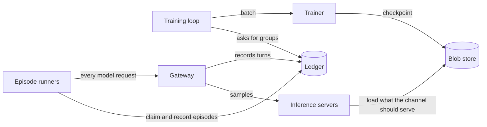

# Start here

A five-minute orientation for anyone new to rollout: what it does, the ideas every other page builds on, and where
to go next for what you want to do.

**Next:** [Three ways in](../guide/perspectives.md), then the section for your task.

## What rollout does

rollout trains language-model agents with reinforcement learning (RL). You write an **environment**: a world, what an
agent perceives in it, what it can do, and how well it did. rollout plays that environment many times at once,
records every token the model sampled, trains the model on the results, and serves each new version of the model back
to the agents while they keep playing.

It works for one agent answering a math question and for a team of four playing Minecraft together. It runs on one
machine with one 16 GB GPU, and on a Kubernetes cluster.

## The main ideas

**Environment.** What a run trains on and an eval measures: a program that plays one episode, its rows (situations,
easiest first), its eval data, how its results are described, and a version. Most environments are written as a
**task** (the world) played by an **agent** (the model's side). See [Write an environment](../guide/README.md).

**Episode.** One play-through of an environment. Each model the program uses (a *model slot*) leaves a trajectory: the
tokens it saw and sampled, and the rewards. See [episodes](../libraries/rollout-train/episodes.md).

**Run.** One job over an environment, recorded under one id: a training run, an eval, a supervised step on a dataset,
or a check of an environment. A training run plays **groups** of episodes and takes **steps**: each step trains on
several groups and makes a new checkpoint. See [the training loop](../libraries/rollout-train/training.md).

**Checkpoint.** Weights a step made, kept in the blob store. Checkpoints form a graph that grows from a base model;
a **bookmark** names one. Any checkpoint can be served, evaluated, or trained on further. See
[checkpoints](../libraries/rollout-train/checkpoints.md).

**Channel.** A trainable model being served, by name. A run's model slots sample from channels; the training loop
writes down which checkpoint each channel should serve, and whatever serves the channel (vLLM, Tinker, a GPU pod)
follows that record. See [channels and engines](../libraries/rollout-train/channels.md).

**Gateway.** The one service every model request goes through. It turns messages into tokens, samples a channel, and
records each turn token for token. It speaks the OpenAI and Anthropic APIs, so an existing agent harness can
generate training data unchanged. See [the gateway](../libraries/rollout-train/gateway.md).

**Ledger.** Append-only tables in SQLite or Postgres that hold every decision and result: the groups a run asks for,
which runner claimed each episode, the steps, the checkpoints, the evals. Processes never share memory; they
coordinate through the ledger and the blob store, so any of them can stop and be replaced without losing work. See
[the ledger](../libraries/rollout-train/checkpoints.md#the-ledger).

**Suite.** A named, versioned set of starts from an environment, with the episodes to play for each. An eval plays
one version of a suite with one checkpoint or a base model, and trains nothing. See
[suites and evals](../libraries/rollout-train/evals.md).

The [glossary](../architecture/glossary.md) defines every other term.

## How the parts work together

A training run goes round one loop, and every arrow in it passes through the ledger or the blob store:

1. The training loop asks the ledger for a group of episodes.
2. Episode runners claim the episodes and play them. Every model request goes through the gateway, which samples
   the channel and records the turn.
3. When a group's episodes have ended, the loop reads them back, weights them, and has a trainer take a step.
4. The step makes a checkpoint. The loop writes down that the channel should now serve it, and the servers load it.

## Where to go next

- **You want to write an environment.** Start with [Run a first episode](../guide/getting-started.md), then follow
  [Write an environment](../guide/README.md).
- **You want to train a model.** Read [Three ways in](../guide/perspectives.md#designing-training), then
  [Train a model](../train/README.md).
- **You want to evaluate a model.** Go to [Evaluate a model](../evaluate/README.md).
- **You want to run the platform for a team.** Go to [Deploy the platform](../deploy/README.md), then
  [Operate the platform](../operate/README.md).
- **You want to add a backend.** Read the [architecture](../architecture/overview.md), then
  [Extend the platform](../extend/README.md).
